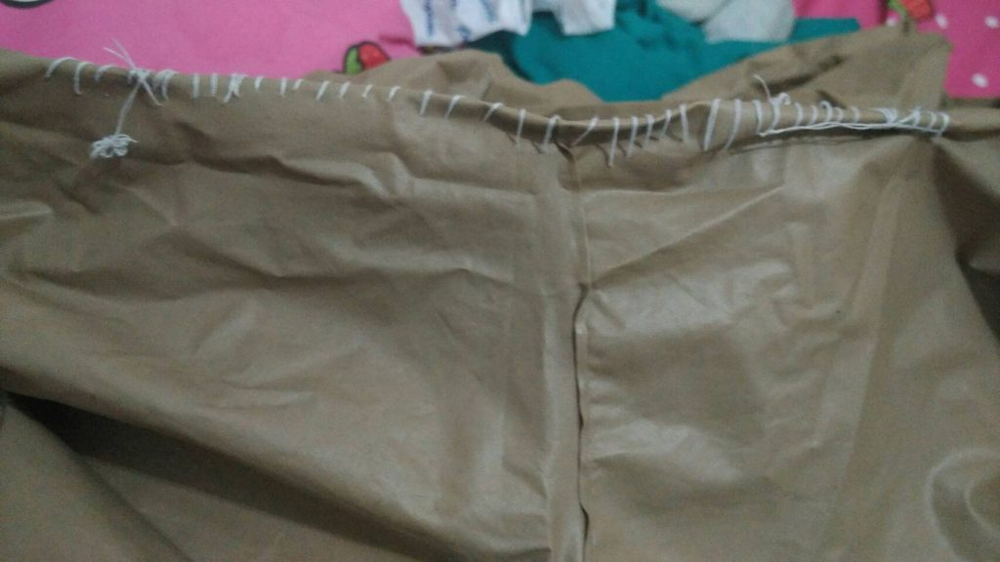

# Sewing Like a Pro

I have a raincoat. A comfort one, because it’s big and easy to use. But poorly, it’s a little bit ripped off. And now I would like to present my skill fixing this raincoat LOL. Please don’t try this at home okay.

Before that, I’d already thought to watch videos from YouTube about how to sew ripped cloth but I found no videos which told the tutorial properly. So I hopelessly decided to sew randomly like I could.

Those photos above were the results! Hahaha please blame me, I wasn’t an ideal wife if I couldn’t sew properly. I’ll try again in another time. I want to give stuffy gift to my ideal boyfriend OMG 😭

