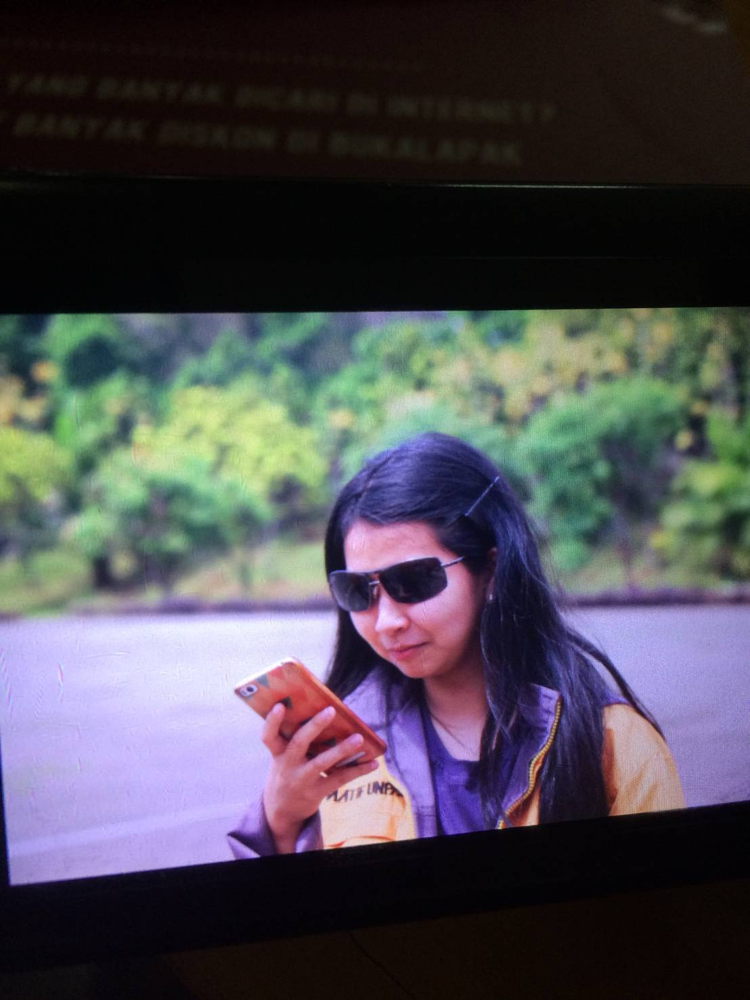

# Weeks of CBS 2017

LAST DAY OF CHARACTER BUILDING SEASON! Well done Delphi you made it! And finally I can be free for a while. This committee is hard but the best I ever joined so far. I think I should tell all days of CBS before we come to tell about the last day today.

CBS, as I ever told you, was an event for introducing Informatics Engineering freshmen to their own department. There were also materials about leadership, organization, and time management. This event was held every Saturday and some days in Wednesday plus Friday on the [first day of CBS](../08/cbs-day-1.md). I participated this event while I was a freshman and it didn’t have a lot of differences with the last year beside Delphi finished CBS early than my generation because their CBS timeline was full. Last year CBS was only in Saturdays.

LOL I’ve just checked that I didn’t tell my stories while taking part in any of Padjadjaran University orientations. I made this blog after I finished all of the orientations so maybe that’s why I didn’t tell it here. Well it’s okay I still can remember it by reading from my personal offline diary which is discontinued right now because I prefer to tell my life in blogs instead. Okay back to topic.

I was being one of the staffs in medic division. Did I ever tell that at first I didn’t want to be in medic division because my trauma in Instagram committee? I wanted to be in event division or academic division instead. But Senior Arie, who was the head of medic division, asked me to join medic division along with Niya because there was no girl signing for medic division. I was glad I join this division because it was far from my bad expectations. The people in this division were nice and fun.

Days of CBS were always fun to watch but sometimes could be annoying. I felt that some of participants were tricking us by pretending to be sick or exaggerating the pain. Well, that’s why I didn’t really like to be in medic room. I preferred following the healthy participants instead. I liked to have a little talk with them rather than nursing sick people.

Every CBS meetings had one of division representations for leading the divisions just in that day. We called them daily division manager. I was being the daily division manager for the last day of CBS. This day was the hardest meeting after last week’s meeting. Last week was the whitening day and all of the participants should pay their mistakes by some physical activities like push up, sit up, run, etc. This day was the sacred day and the participants should show themselves in front of the family of Himatif. If they failed, the committees would be the people who pay their mistakes by some physical activities.

I said this one was the hardest because at that time I had to think everything went smooth and did physical activities at the same time. Today was also so hot and I almost went blind. I borrowed Islam’s sunglasses to cover my eyes but people who saw me laughed at me and even took photos of me. I wasn’t mad but glad I could make them happy even though I didn’t intend to joke in this serious time.

This meeting wasn’t finished until the night came. The night was scarier than the morning. All of Himatif family members were gathered and the participants who got sick were increased. I had to go back and forth from the medic room to the meeting point to check everything. I had to admit I almost cried because I hated that I had to work hard while some committees were jobless. The medic division staffs were only a few but there were almost none of other divisions who wanted to help us. Finally this committee was ended and I could sleep well for a while.

