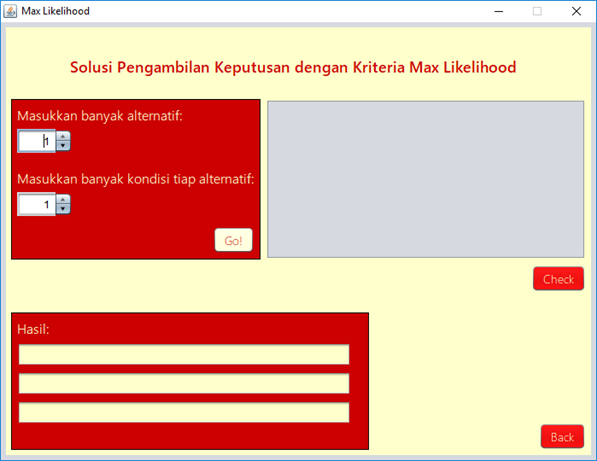
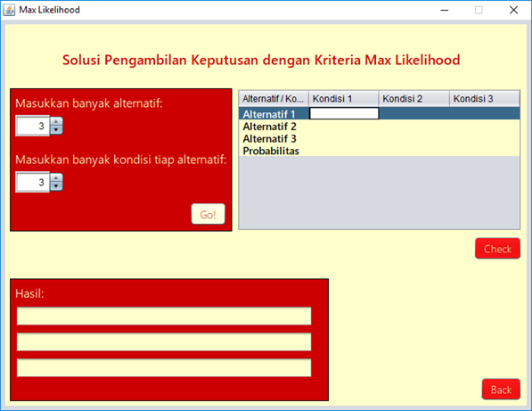
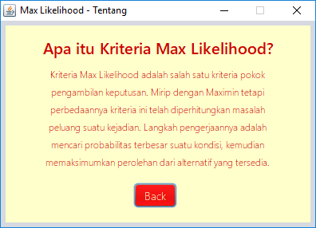
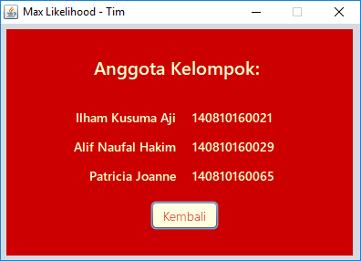

# Max Likelihood in Java

 This post is written just to tell a useless project of me. Why is it useless? Because I only revised my senior’s project and collect it to the lecturer for my final test of operation research study. Max Likelihood is one of the methods that is used for … My lecturer asked all students in my class to make a computational program of any method using any programming language. I chose Max Likelihood method and coded in Java since I had references from my senior, Senior Umar. I revised the UI and cleaned the code so that my lecturer would not notice if this project was familiar. \(PLEASE DO NOT FOLLOW THIS NAUGHTY PLAN OF ME\)

Here’s a screenshot of the project:

How to use it? First, make sure you have installed Java in your PC or this program won’t work. Then open Max\_Likelihood.jar. Click “Start” to start the program. Fill the column of how many alternatives and the conditions you want then fill the conditions on the right side one by one. Click “Check” to get the results. That’s it!

Get the program in my Github [here](https://github.com/realicejoanne/opris-project). Since I had already tested this program and it worked well, I am 100% guaranteed this program will work as well for you. Feel free to reuse this but don’t claim this as yours! Because I will be the bad person by sharing people’s project to others.

