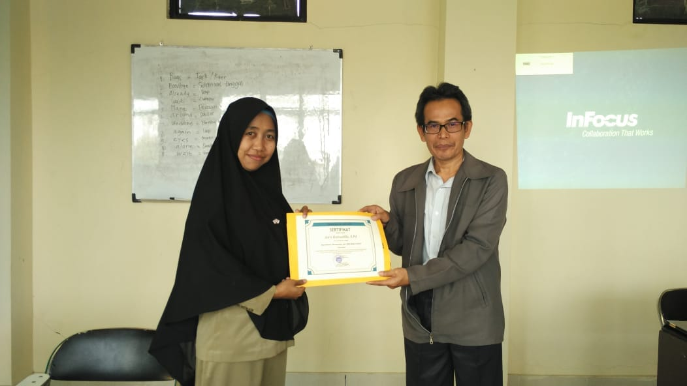

# Presenting An E-Learning Website To A School

This was my first project outside campus project that I had made. I collaborated with Shofiyyah to finish the website. The website was basically for Mrs. Mira’s campus service program \(or in Indonesian, it was KKN\) team. She guided the team to develop an e-learning system for a school, and the lucky school was Vocational High School of Baabul Kamil in Cikuda, Jatinangor. The website was made by me and Shofiyyah but the contents were created by the campus service program team. The contents they created were presentations, e-books, and videos. They were also helped by the teachers in that school, long before Shofiyyah and me started to develop the website. Shofiyyah was the back end developer and she only used the very basic PHP as the back end while I was the front end developer who used the very basic HTML and CSS as the front end. We were not chosen by Mrs. Mira, but more likely Mrs. Mira opened a recruitment for the developer team of her campus service program team and in that time we signed up for it.

We liked the project so much because it didn’t really need very good skills to develop the desired website but the biggest problem was how to share the website locally using flashdisks.

Oh yes, I forgot to tell how I got to the school. So today I went to Mrs. Mira’s room in the lecturers room and we went to the school using Mr. Ino’s car. Shofiyyah couldn’t come because she wasn’t in Jatinangor yet. Some of the campus service program team members were also not coming with lots of reasons. And I really hated that Mrs. Mira was so kind with the team although the team members that were coming only two of them. I was very jealous with that team because they got a very kind lecturer mentoring them. The presentation to the teachers of the school that I thought it would be done by the campus service program team, was done by Mrs. Mira and Mr. Ino. Wow. So nice of her. Those two campus service program team members even didn’t help her but they only sit to watch the presentation. Here are some of the documentations from the presentation time.

Back to the development problem. At first Shofiyyah and I used XAMPP mobile but some of the flashdisks that we installed were giving too many errors. A lot of errors meant the website couldn’t be accessed. Unlucky me, the errors came in the presentation time. Although the presenter was not me but Mrs. Mira and Mr. Ino, I still felt guilty about it.

It took very long time to find that USBWebserver was our solution. USBWebserver worked like XAMPP mobile but it was better. Too bad we got this USBWebserver long after Mrs. Mira and her team presented the website to the school so I didn’t know how was it going with the XAMPP mobile version in that school.

This is a good experience for me and Shofiyyah because we got a patent for the website. It took a long time to get the certificate but worth very much because the efforts weren’t not as much as campus projects LOL.

