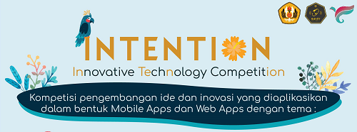

# It’s Not The End of SpotEvent

TL;DR – This is the first computer science themed competition that I won but I hate to show it off.

It all started when Senior Ojan had an idea to make INTENTION succeed. INTENTION, which was stated for Innovative Technology Competition, was a competition in the biggest event of our department: IFest 2018. INTENTION was originally held last year and it will always be in IFest, Informatics Festival by the Informatics Department in Padjadjaran University. This year, INTENTION had two categories, same as last year. There were Android App Development and Web Development. The idea that Senior Ojan offered was to join both of the categories. I joined Android App Development along with Shofi, Senior Umar, and him while Vega, Senior Gilang, Senior Ihsan, and him joined Web Development. You know what, Senior Ojan was the leader of both teams.

Almost every time we wanted to work on this competition, we were always together. The Android app that my team made and the website that the other team made were instructed by Senior Ojan. My team made an Android app about finding sponsors for events named SpotEvent and the other team made a website about finding donators and teammates for developing software ideas named Creatable. Luckily we made it into the final together. But I hated the fact that the main reason we could reach the final was because there were very few rivals and also Senior Ojan was an important person in IFest although the ideas that we brought were quite awesome.

Today was the final day along with the national seminar of IFest 2018. I believed that what we presented in front of the judges was the worst of all finalists. That damn stubborn leader wanted to get all the attention to him while in fact he almost did nothing other than his awesome ideas. My, my. I was very angry at him not just because of this. I remember in the elimination stage, he scolded me because I uploaded the submissions late. I didn’t want to blame the other team members but him. He was the worst leader ever for a competition like this.

In the end, we got the favourite winner award. I believed that was no more than to appreciate those who made it into the final. The award was quite useful although I didn’t need it now. It was a free hosting service for a year by Dewaweb. Jeez, I could use it for my user interface project but it was already too late. That photo above this paragraph, I didn’t understand why I was laughing while in fact I was dead inside.

Ah yes, I forgot to explain the title. I said that “this is not the end” because both teams agreed to continue the Android app and website as our projects. Let’s see what will happen.
