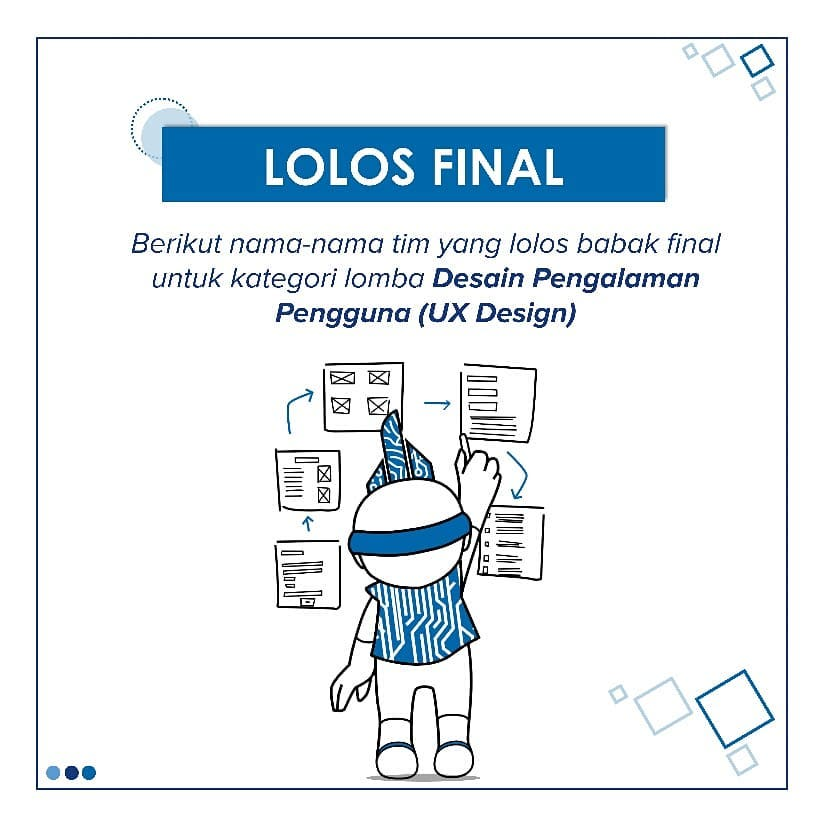
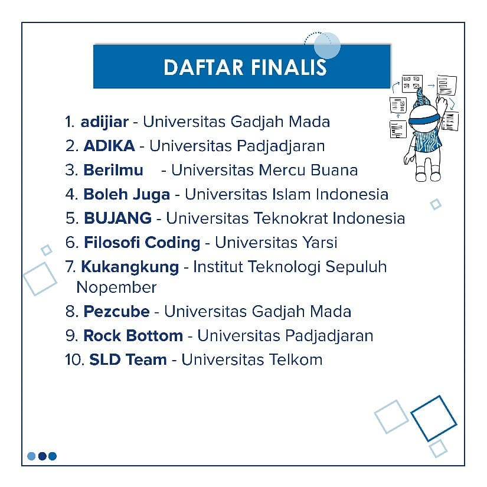

# Shocking Day

This day is the luckiest day in this year so far. I got two good news in one day!

The first one is getting the Tech in Asia 2018 ticket. I was chosen as one of the 5 winners of the official giveaway by Tech in Asia Indonesia itself! The giveaway post can be seen [here](https://www.instagram.com/p/Bof7iCqlBsc/) and the winner announcement was posted in Instagram story so I didn’t have proof of it. I forgot to screen capture it. Well actually I couldn’t believe myself because the participants were so many even Senior Ojan and Senior Dicky joined. I had to say thanks to them because I knew this giveaway program from them. I didn’t really use my Instagram a lot even though I separated my Instagram life into three accounts.

The giveaway program that I joined was the second giveaway program of the same year’s Tech in Asia ticket. The first one was held in Instagram story and announced the winner also in Instagram story. One of the lucky winners was Senior Tyara, that’s why Senior Dicky wanted to win the giveaway too. On the second giveaway, Senior Dicky won in the same giveaway program like me! I wondered what’s wrong with these Tech in Asia tickets giveaway programs. Ten winners and three of them were from Padjadjaran University, or in exact, the Informatics students? Well, forget it. At least I won haha.

Actually Senior Ojan was kinda angry because he didn’t win. I tried to comfort him that there will be more giveaway programs again. Man, seriously Pat stop! I don’t want to talk about his jealousy in this professional blog so let’s just skip it -\_-

The second good news was the announcement of GEMASTIK 11’s finalists. Oh my God. My daring team made it into the final! I repeat. Rock Bottom team that consisted of Rifqy, Raihan and me as the leader, was joining GEMASTIK 11 in UX Design Category and we made it into the final!!! I couldn’t believe my mind anymore. Let’s discuss about GEMASTIK 11 longer after I finished the competition instead of writing it all here. What I could tell you, this was so unbelievable. Half of my heart wanted to believe that we already did the best in the elimination stage but the other half said, let’s give up since we didn’t prepare everything from the beginning of the registration. We got the idea about two weeks before the deadline of the elimination stage and we rushed to finish the submissions. In fact, we even didn’t upload it on time because there was a problem with the official website of GEMASTIK 11.

The last thing that happened today was the reunion of INTENTION’s favourite winners. Remember what I said before in [this post](../09/its-not-the-end-of-spotevent.md)? We would make our products from INTENTION as our serious projects. Today we learn more basics about React. The Android app which was first developed with native Java and the website which was first developed with Angular would like to be improved as a React app. Both of the teams met up and learnt React in Senior Gilang’s room. Although the meeting was not really useful because of the installation time, we still had some fun in the room.

