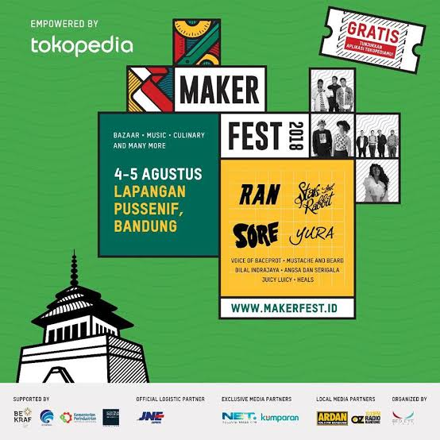

# Tech in Asia 2018

Remember when I got the free pass from [this day](shocking-day.md)? Unfortunately, because Senior Ojan was kinda mad to me, I had to pay a ticket for him. The ticket I bought was a student pass not a general pass like I got from the giveaway. Although the ticket was kinda much to me, I still had to thank him though because he handled all of the transport and hotel fees. This year is the second time I went to Tech in Asia event, the first one was last year which I posted in [here](../../2017/11/tech-in-asia-2017.md).

We were enjoying the event with Senior Tyara and Senior Dicky. To be honest, I preferred the last year’s event. I didn’t know if that’s because last year was my first time or this year was too plain. As usual, I gathered freebies and flyers from every stand in Tech in Asia as much as possible. I barely found popular start ups here not like in the last year. Also, I felt that most of the start ups didn’t like general or student pass people to visit their stands. They preferred to talk to people with sponsor pass. I knew that’s very obvious but I felt sad because they desperately wanted some sponsors to help their start ups and ignored curious people like me. Jeez, your start ups were not unique and seems profitable but you asked sponsor to help you? Believe me, you will die sooner if you’re not showing any unique features and programs!

The event was held for two days and after that we were going home. Now that I saw how Tech in Asia changed from an event to fulfill our curiosity on spectacular start ups into an event to help small or unregistered start ups to get sponsors, I won’t go there anymore next year. Tech in Asia was also trying to not give student pass anymore. This year we were just lucky because the Google Form to get the student pass was shared from our lecturer and if we just missed it that time, the student pass would be sold out and I didn’t want to give a fuck to pay the general ticket. Dude, the price was too high for a simple-minded person like me who just wanted to get ideas and freebies 😩

