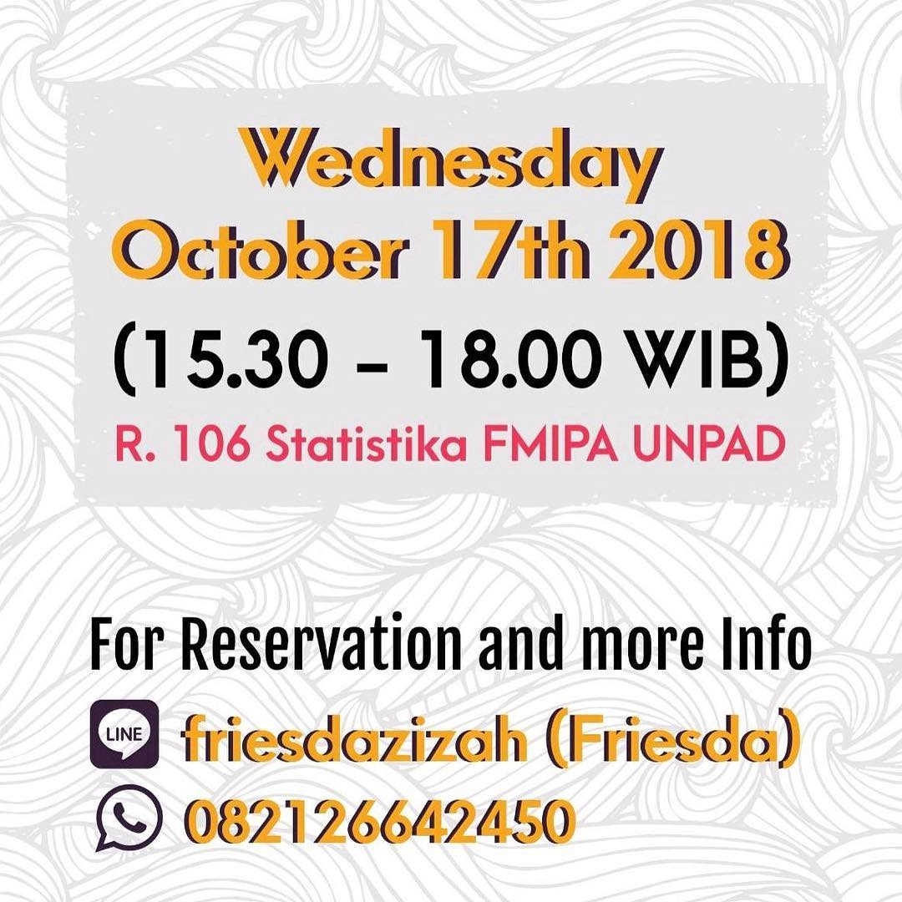
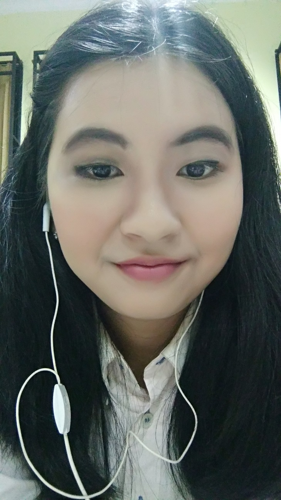

# Thank You Wardah Beauty Class!

Hey, it’s me a woman who couldn’t make up myself! It’s true that some parts of me just like being natural, but the reason why I like being natural it’s just because I didn’t know how to make up. I wanted to learn it but didn’t know how to start it. The reality was not as in “The Secret of Angel” comic. Or maybe that comic was true because the background of that comic was in South Korea which was the place of many beautiful women with make-up skills, while in Indonesia, I couldn’t find any good references to start learning how to make up.

One day, I saw that Statistics Day partnered with Wardah and they opened for a beauty class. Thanks to Viona, who was a Statistics student and also one of the committee members of Statistics Day, I could go to the beauty class. To be honest, I was afraid and shy because most of the people in the class brought a friend while I was alone. My fear came real when the coach asked every class student to get a partner. Actually the partner that I had to get was not for helping in the middle of making up but that was because the coach didn’t have too many kits to share for each class student so me and my partner should share the kits together.

This beauty class was held in Statistics building in the afternoon. The coaches taught us the very basic steps to make up. I could say the lessons were practical, it’s just me who couldn’t follow the lessons. In the end, here’s the result of my dull face after finishing the make-up session. Please don’t laugh 🙃

This Wardah beauty class was worthful because the 100 thousand rupiahs I paid for the make-up session was actually for a voucher that could be used to buy Wardah products worth up to 100 thousand rupiahs. I was lucky to get three products to use that voucher as much as possible without using my money. I bought a body cream, lipstick, and lip balm. Not to mention I also got the Wardah goodie bag. Finally, I went back to my temporary home. Since it’s was already night so I let my make-ups on. But when I arrived in my room, I wiped out the make-ups as soon as possible. Sadly, I used tissue and water since I didn’t have any make-up cleanser. To be honest, because of that I couldn’t get rid the mascara easily. I just had to wait those mascaras gradually wiped out.

