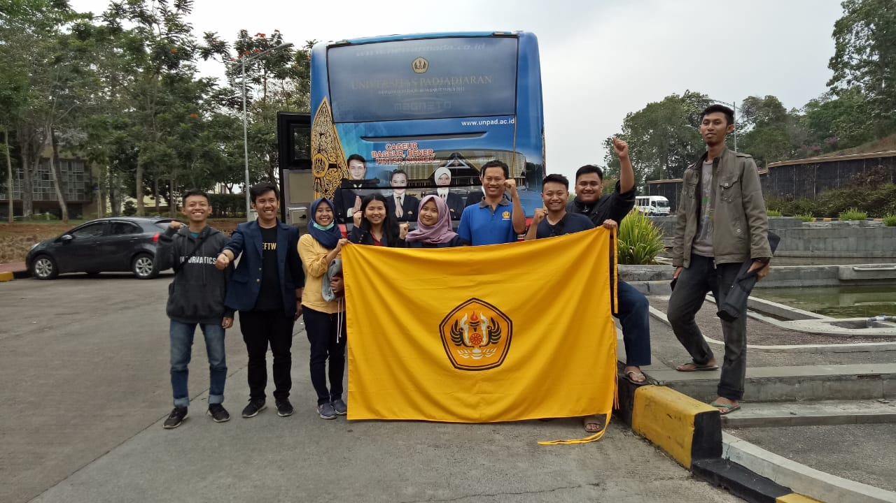
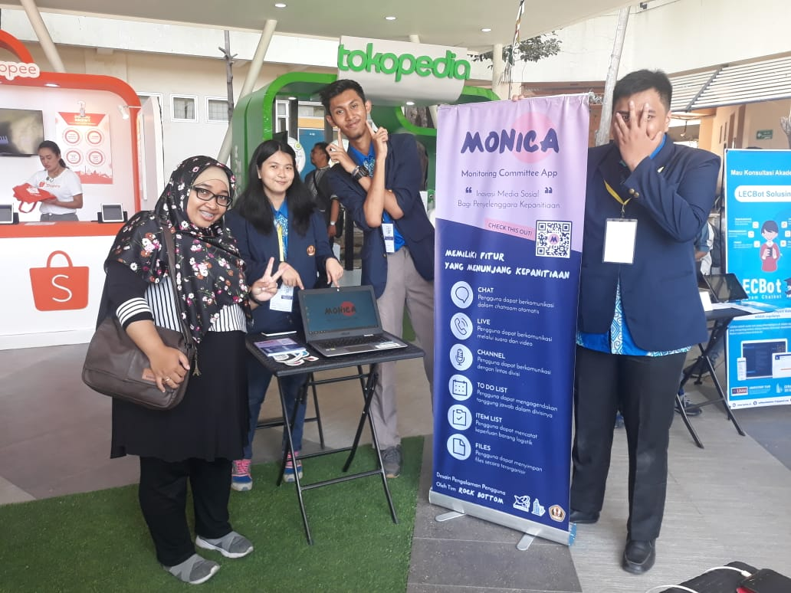
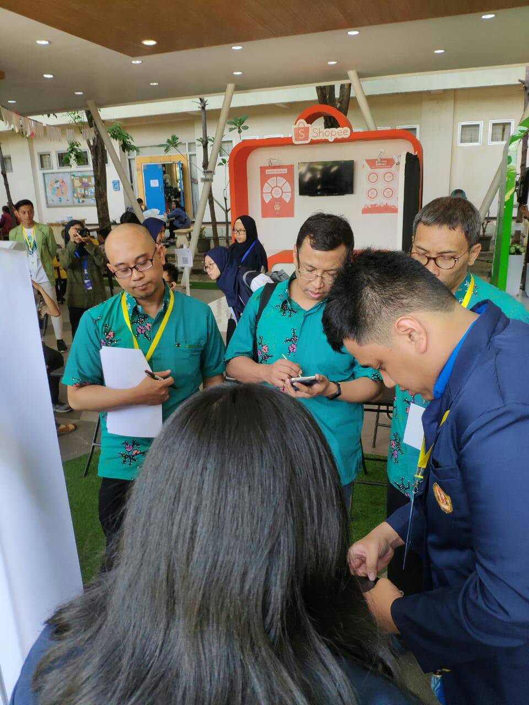
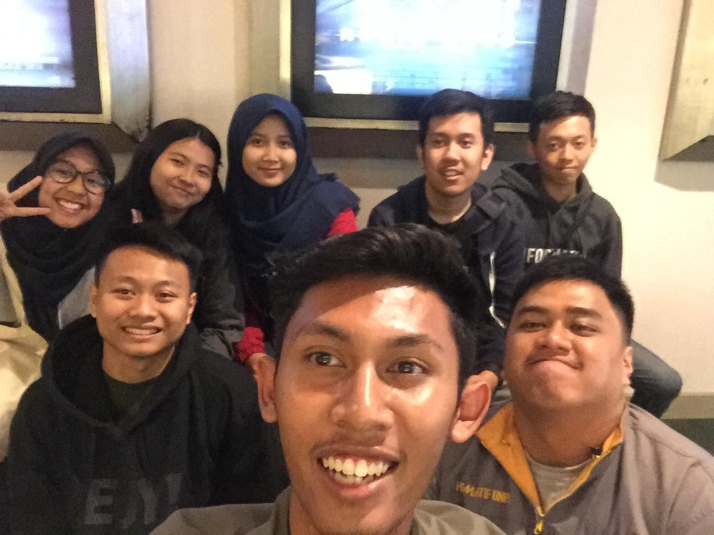
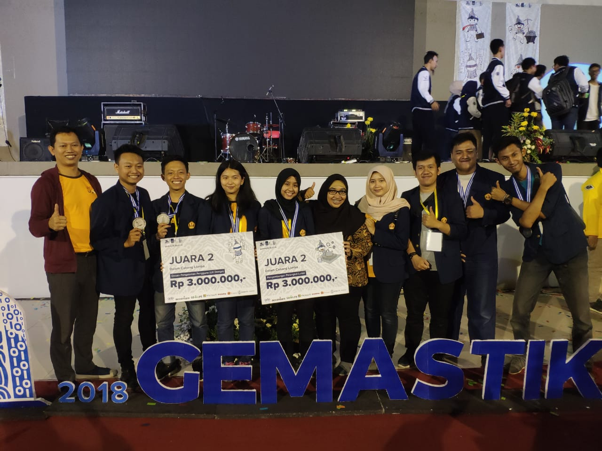
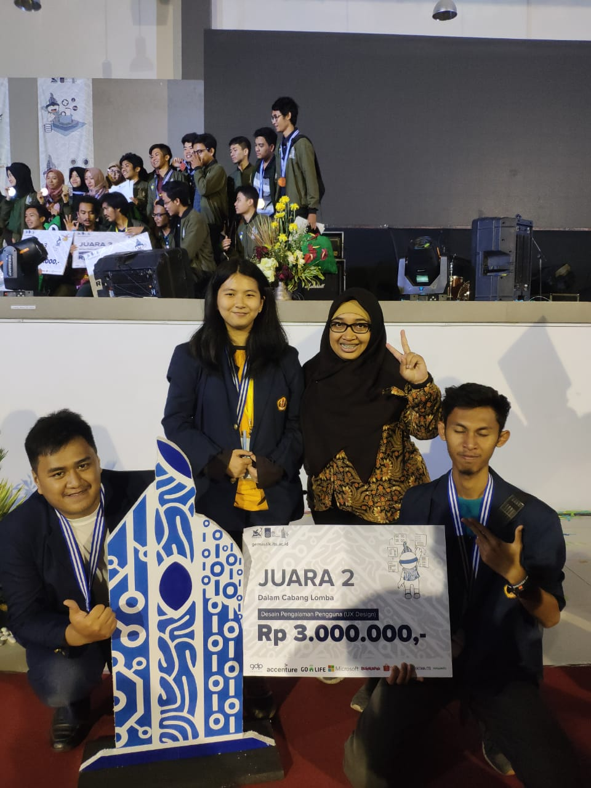
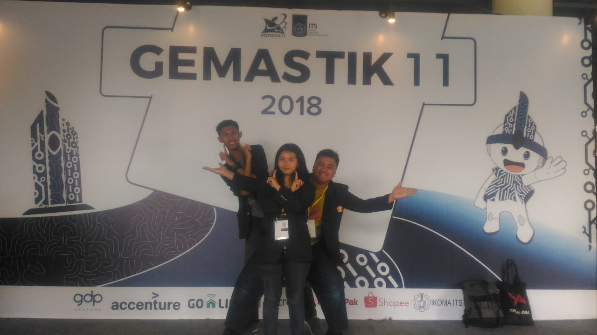

# GEMASTIK 11

Here’s the best day of this year that changed my fate.

One day, my lecturers shared a competition named GEMASTIK. I was interested to try it and gambled by asking my gang members if there’s any of them who wanted to join me. Rifqy and Raihan said they wanted to try it as well and we became a team. We named our team “Rock Bottom”. There’s no personal meaning of it but to be exact, it was from Rock Bottom which was a dark place in Spongebob Squarepants series. GEMASTIK had a lot of categories, such as Game Development, Software Development, IoT, etc. If I wasn’t wrong, there were 10 categories. We chose to join the UX Design category.

Actually at first we didn’t take this competition seriously. We were so busy with our business and then when the due date was near, we were panic. We discussed almost everything in the group chats including the idea that we would use. The idea was making an application like a social media application but special for committees purpose. This idea was come because we were almost like a slave for committees in the university and even outside the university like Rifqy who was busy with his Islamic association in his neighborhood. We named it Monica, which was a short for Monitoring Committee App. The idea was from Rifqy and Raihan and the application name was from me. I used a person name because I thought it would be more friendly to use. Like a chat bot, they usually had a person name right?

The application designs and its processes are mostly done by me while Rifqy was busy with the videos and marketing matters. There was also Raihan who helped me to find resources and made the application prototype using Android Studio. \(Later in the final we found out that prototype was no use. Sorry Raihan…\)

We uploaded all of the requirements for the first stage late. It’s because of stupid me who uploaded the poster using PNG format which had bigger size rather than JPG format. Man seriously the website of GEMASTIK was suck because it strictly limited the size of the file that we uploaded. At that time I said sorry to my team because of my stupidity and we would accept if we were lost because we were late.

Then, in this surprising day, we found out that we made it into final stage! Yipee yayy!! Some parts of us were happy but other parts said “OMG!” because we didn’t expect to be into final stage. We totally forgot about GEMASTIK and we didn’t do any progress since we expected that we should be lost because we were late. Because of this, I got some people badmouthed about me leaving [the last day of CBS](../10/im-sorry-cbs-2018.md) while I was trying to finish all of the requirements for the final stage.

Since we were already the top 10 teams that would be in the final stage, we only had to add some information about the app in the report and also made a presentation that couldn’t be changed in the day of the final stage. To be honest, I worked harder for this stage because the information that needed in the report was exhausting. We had to add the wireframes of the application while we were done designing the high-fidelity designs. Jeez, that way was kinda late to do actually. They should ask for the wireframes in the first stage. For the presentation, I let Rifqy to do it and he impressed me a lot because he didn’t just make a plain presentation but completed with cool animations so that our presentation was like a video. In fact, the video that we made in the first stage was made using Powerpoint and saved into MP4 format LOL. As for Raihan, he kept maintaining the application prototype. This time, we didn’t upload it late. We knew that we were finished if we did it again.

Anyway here’s the promotional video that we used.



There were also ADIKA team with Senior Tyara and Senior Dicky as the members who made into final stage of UX Design category. Not just UX Design category but Padjadjaran University also sent PadjadjaranVR team, consisted of Senior Bob, Senior Alwan dan Farah from Dentistry Faculty, into final stage from Software Development category. This was much better than other previous years because Padjadjaran University finally could send three teams into GEMASTIK final stage. There were actually more teams joining this competition from some categories although most of them didn’t make into final stage.

Several days before the day of the final stage, we were practicing our presentation skills in front of our guiding lecturers. My team was not fully confident because there was ADIKA team who excelled with their designs and our guiding lecturer Mrs. Mira who was also their guiding lecturer liked to mention their works to help us doing the preparation of the final stage. Rifqy told me that I shouldn’t be worried about anyone and kept doing our best. Seriously, my team consisted of awesome members.

Finally, on October 31st the students were going to Surabaya using bus and train. First, we went to Bandung Station using the bus and then went to Surabaya using the train. Actually at first we were fucked up because the rectorate paid for our train tickets so late. We even thought we wouldn’t go that day because they bought the tickets in the day of our trip. If the train was full, we wouldn’t arrive on time then.



Yeah we arrived in Surabaya not very on time. We had to bring the luggage into the venue because when we arrived, the ceremony was about to start and we didn’t have much time to bring the luggage into our dorm. Senior Dicky and Raihan were chosen to be the men that brought the Padjadjaran University flag in the ceremony.

By the way I forgot to mention that the venue of the final stage was in Technology Institute of November 10th. On the first day of the final stage, there was only the opening ceremony and the technical meeting of each category. After that, we went to our dorm. Because we were late that morning, we had to wait to get the room for us. I got the same room with Senior Tyara and Farah since we were girls. The boys were in the same room. They got a big room though. That night, the girls including me were going into the boys’ room and asking the guiding lecturers to join as well. We were practicing again for the presentation there.

The next day was the serious day. It’s the presentation time! At the technical meeting, my team got the number 6 which meant that we were present on the 6th both in application demo and design process presentation. Thanks to Raihan for the application prototype even though actually we could use Marvelapp easily. Thanks to Rifqy who presented the application demo in a very exact one minute. These were some photos we took in the stand of application demo.

To be honest, we spent a lot of money for the stickers and flyers but unfortunately the stand was not as what we expected. There were no visitors coming. The stands were only for the judges judging the application demo. But because of the stands, my team befriended with the teams from Gadjah Mada University which got number 7 and 8 so my team were between them. We traded the stand merchandises and talked about random things.

Our team’s presentation time was after lunch time, about 1 PM. We presented Monica like we always practiced. We were expected to get some bizarre questions but I felt so grateful yet couldn’t believe what happened. When we finished our presentation, the very first question that was asked to us was “Why did you choose Rock Bottom as your team’s name?”. LOL I thought Rifqy would be responsible to answer that. After that, we were only got easy questions that were actually already in the report but yeah it’s okay if they didn’t read it. I said that I couldn’t believe what happened because I thought that the judges didn’t know what could be expected from our application. The judges were not young so they didn’t really understand how committees worked. It wasn’t very lucky but I hoped for the best result.

Finally, after waiting for ADIKA team which was the last team that presented to the judges \(they got number 10\), we were going back to the dorm and then at night we were going to the nearby mall. We were watching Hunter Killer in the cinema and walked through the mall. Well actually I didn’t expect to see lots of pork in the mall haha. Surabayans were quite brave huh? After spending times in the mall until the mall was closed, we were going back to the dorm and slept peacefully. Of course, because we didn’t have to do anything until the next day.

I forgot what me and everyone did in the last day in Surabaya but I was sure we were going to get some souvenirs from Surabaya. I bought not so many souvenirs actually and most of them because I wanted to try it by myself haha sorry. The souvenirs I bought were sweets and there’s no merchandise like bracelet or something. That’s why Senior Ojan was very disappointed to me and I didn’t want to explain how sad of me here bye.



The winners was announced at night of the last day. I didn’t want to talk a lot but WOOHOO MY TEAM WON THE 2ND PLACE IN UX DESIGN CATEGORY!! It’s unbelievable daaamn. PadjadjaranVR team also won the 2nd place in Software Development category. Too bad ADIKA team didn’t win but we were still happy and took some photos below.

Ah yes by the way we also took a photo together in the normal photobooth on the first day and 360-photobooth on the night of the last day. Yeah they said it was 360 degrees while it was just 180 degrees I thought haha.



These exhausting days were finally about to end. We went back to our dorm for the last time to get some sleep and then in the morning we went to the station to ride the train and use the bus to get back to the campus again. I didn’t tell a lot about what happened in the station of Bandung and Surabaya while we were waiting for our train because we were so useless there. Surabaya Station was the worst, we had to go inside to one of the cafés in the station because the weather was very hot. To be honest, I was stupid to not bring shampoo in this trip. The hot weather made my hair was in a bad condition, not to mention that I got some fleas in my hair damn it. Here’s the last photo of us safely arrived back to our lovely campus.

