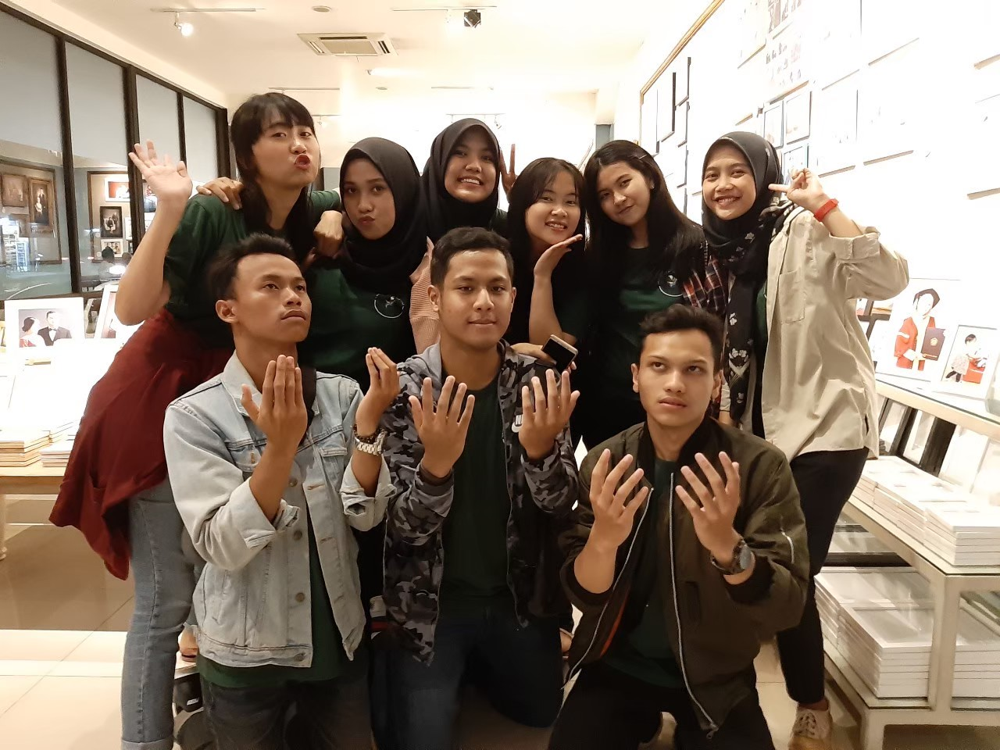
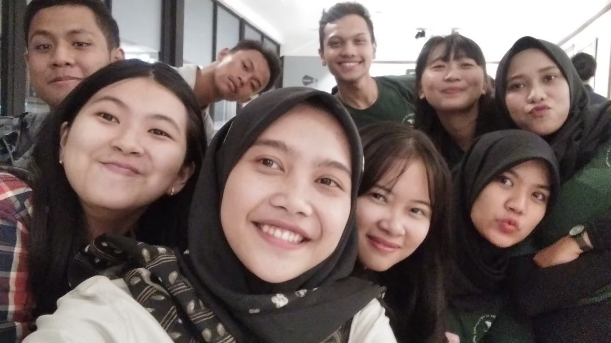

# I’m Sorry Too PEF 2018

PEF was an event that I dreamed to be one of the committee members. It’s because I would like to try one of committees handled by the whole university students. The Student Executive Board of Padjadjaran University has three main events: PEF, Prabu, and FORSI. I didn’t choose Prabu because it’s like CBS but more exhausting since I had to handle the whole freshmen of Padjadjaran University. Also I didn’t want to waste my time to stay in Jatinangor to meet up for committees when it should be holiday. I also didn’t choose FORSI because it’s like Instagram but more exhausting since I had to handle the whole championship with more categories in Padjadjaran University. I preferred PEF above the others not just because that’s the only one option but also because I was interested on it since Senior Tiar was being one of the committee members of PEF. I heard PEF didn’t ask for committee fees and even gave things like committee ID, t-shirt, and lunch for free. But unfortunately, I was not lucky because the core committees of this year’s PEF were so lame. They didn’t just ask for committee fees but also forced all committee members to sell PEF tickets and a product from its sponsor.

PEF was a short name of Padjadjaran Education Festival. It’s held for 2 days every year and had some main events dedicated to high schoolers who wanted to know about Padjadjaran University. There were faculties stands, campus tour, talent test, bazaar, talkshow, and art performances. Unlike Aku Masuk ITB, this event is not free-entry even though I had to admit events by PEF were much useful and better than Aku Masuk ITB which only had faculties stands.

JEEZZZ, I envied this year’s Prabu. They were so much better than other Prabu that had ever held before while PEF was being degenerated this year. Even though I felt this year’s PEF was suck, but I felt so happy I could work together with my visual design division team. The head of visual design division was lost contact in the middle of the event preparation but all the staffs were still doing our best. Too bad I couldn’t go to the PEF events because I had to go to Surabaya for GEMASTIK.

In PEF events, the visual design division team didn’t have anything to do like other division and because of that, they were taking many photos together. Since I wasn’t in the photos like other staffs at those days, I shared these photos of our first meeting and the photo from Jonas photo session \(without the head of visual design division\).

These photos were taken on March 4th, 2019. It’s the future from today LOL.

