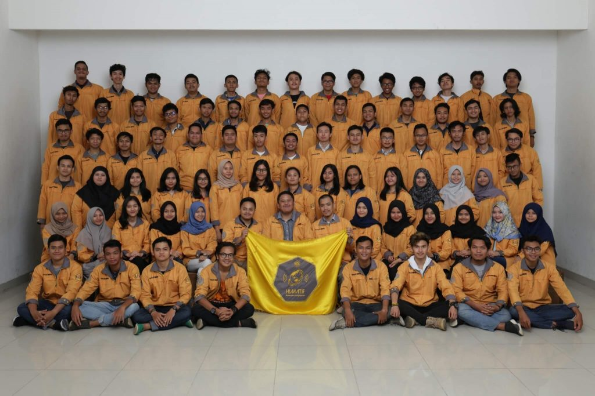
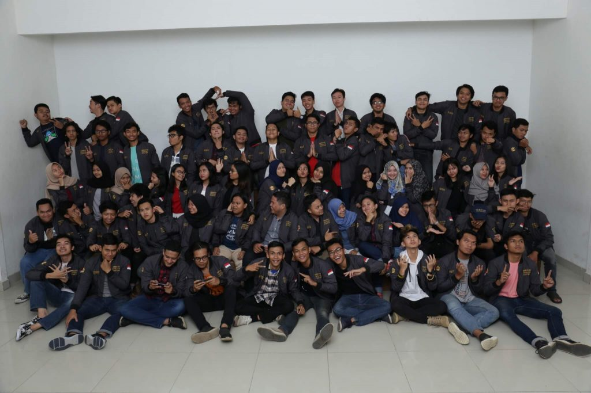
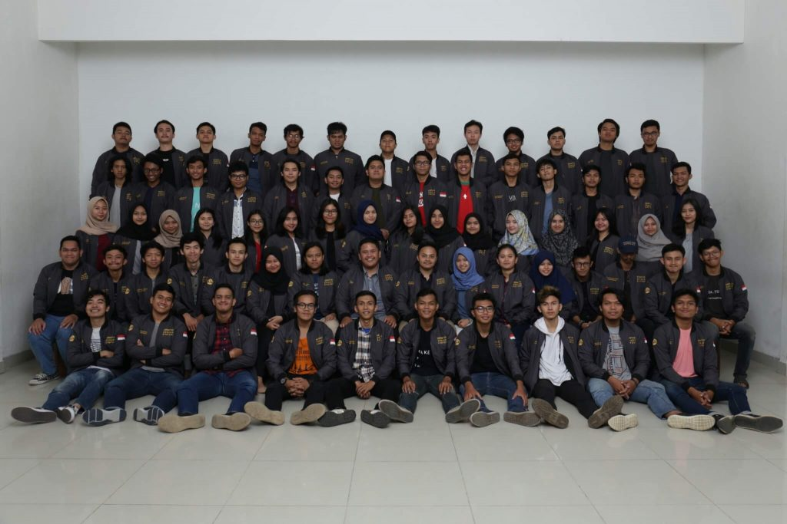

# Symphony Cabinet Photo Session

After being a pending plan for a long time, finally the organizers of Himatif took photos together in Jonas. The actual plan was at 4 PM but because there were some people who couldn’t arrive on time so we waited until they came. I hated when I had to wait. I had a serious flu since last week and I still didn’t feel well. I really wanted to rest at that time. I was tired to sneeze and wipe my nose.

While waiting for some people to arrive, I bought es doger and siomay that were sold in front of Jonas. I knew I shouldn’t buy ice because I was sick but I was so stress and needed to eat. Honestly, the price was too high for a glass of doger ice but I didn’t care. I wanted to enjoy it while I was waiting.

We got our turn at about 9 PM. The photo session didn’t take a long time as long as the waiting time. These are the photos that we took. The first session was for Symphony Cabinet which was the Executive Board and Aegis Cabinet which was the Legislative Board.

The second session was for Symphony Cabinet only.

Actually my bureau planned to take photos together too but at that time Abie couldn’t come because he was already in his residence. Ah yes, it was true that the photo session didn’t involve every Himatif organizers of 2018. There were some of them who couldn’t come like Abie. It wasn’t the first time that the photo session wasn’t full team but last year’s too. So sad.

