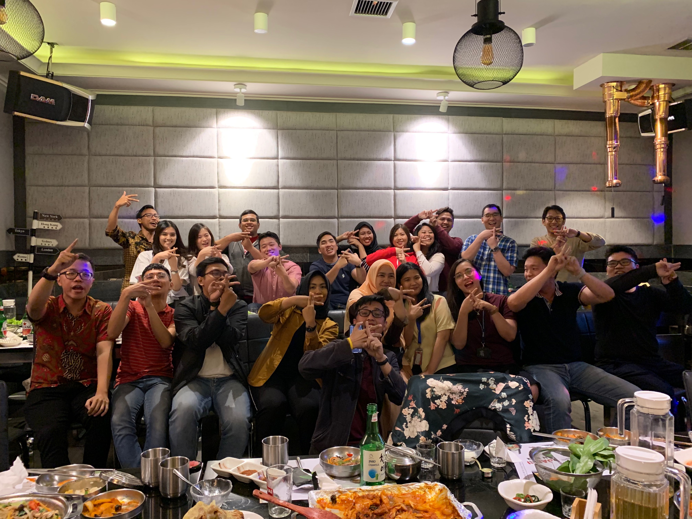
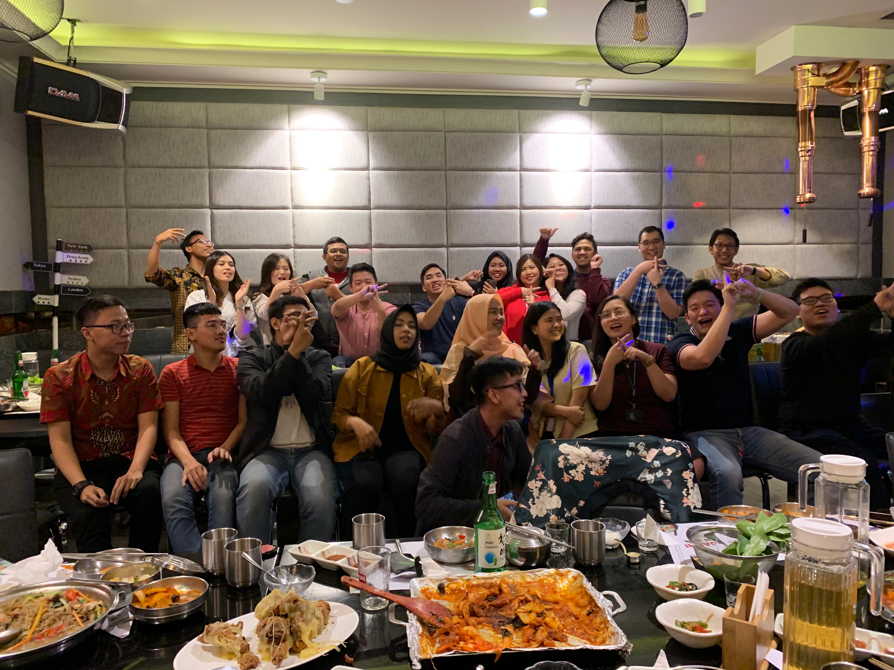

# Happy BBQ Time!

It’s happy BBQ time!

Chinese New Year’s vibe is still here until today and the GA \(general affairs\) team was planning a BBQ party for Kargo. It was held in Yongdaeri Korean BBQ, near our office, in SCBD.

This night, we went there by walking. The GA team already booked a VIP place for Kargo. At first we were served with some Korean vegetables that I didn’t really like. While waiting the main foods, we were trying to use the karaoke player. The first people who got the chance to sing were Maggie and David because they were the new members of Kargo. After that, they chose other people to sing. Almost of the employees who came at the party had gotten their chance, but when the main foods came, we didn’t force anyone more to sing. Instead some of them were volunteering to sing. The main foods were soooo many I didn’t even know what the names of each foods. There were chickens, beef, noodles, and many more. We also got soju, the Korean alcohol drink. I only tasted a little but I didn’t like the taste of it.

After being full with foods, more employees were singing voluntarily. I actually wanted to go home with Maggie because our houses were in the same neighborhood but I didn’t see when she was already gone so yeah I spent my time until the party ended. We were taking photos together there and here are the photos!

There were actually still some foods left and Ms. Ayu, one of the GA team, wrapped them to be taken away. I took some of the leftovers because I knew my family would like to try them. Because of that, Ms. Ayu asked me to take the whole of the leftovers but I refused. Ms. Ayu thought that I wanted to take some foods so that I could bring them back to the officer tomorrow but I didn’t want to because I went to the office and went back home using Transjakarta buses and it would make me inconvenient. I didn’t know what happened to the rest of the leftovers. I wished they could be eaten in a good way. As for the leftovers that I brought to home, of course they were eaten too fast even I didn’t remember to get my portion 😑

