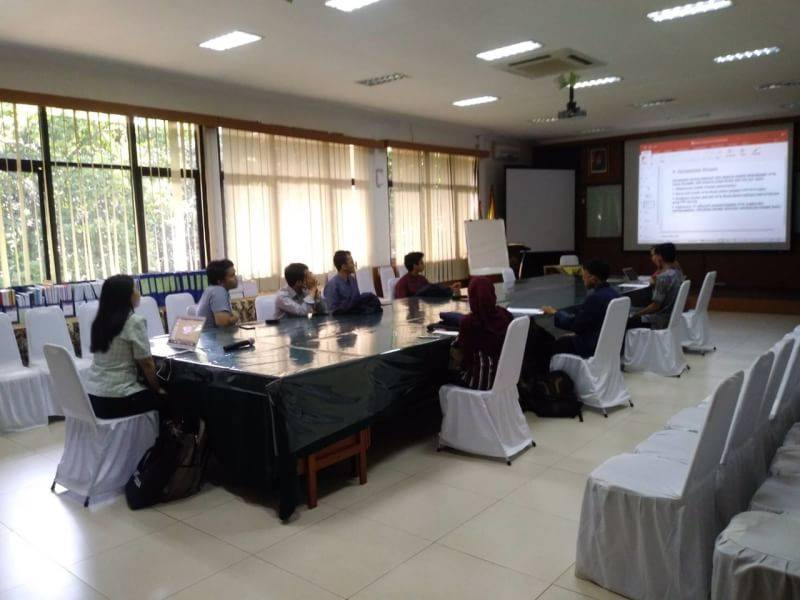

# The Most Outstanding Student Goes Wrong

Most Outstanding Student Contest \(Pemilihan Mahasiswa Berprestasi\) is an annual event held by Ministry of Research, Technology, and Higher Education in Indonesia to appoint students with high achievements proved by scientific paper, foreign languages proficiency, and good attitudes. To participate in this contest was one of my dreams, but I only had one body so sometimes I should let my dreams go.

The event was started from selecting the best student in the department, then in the faculty, and then in the university, and the last one in Indonesia. A student didn’t have to be smart or popular, but if you were smart and popular, you could gain a lot of plus points. That’s all I could describe and here’s my experiences.

One day, my department, Department of Computer Science, shared a registration form to participate in this contest. The members of Himatif Executive Board at that time, Cohesive Cabinet, shared the form to some potential participants like me, Rifqy, Raihan, Baby, and many more in my generation. The registration form asked about our personal information, the awards we received, the whole score transcript from the very first semester until now, and yeah that’s all. Actually I already sensed something wrong with the registration form. As far as I knew, I should submit an essay for participating this contest but my department didn’t ask it. And I was right.

Several days no longer after I filled the form, Mr. Juli, the head of my department, contacted me via Whatsapp and said that I was chosen to represent as the most outstanding student in my department. I would fight in the faculty stage. The news spread fast, and when my generation heard that, almost nobody supported me. It was different like when the registration form was shared in the beginning. Most of the people in my generation’s group chat supported Baby a lot. I wasn’t surprised about this though because what could be expected from a rotten generation like that.

Back to the moment when I got the news from Mr. Juli. He supported me a lot, although his words were look like sarcasm because I never saw a lecturer supported me like a friend. What the hell man, he said this literally a day before the faculty stage. Remember what I said before about my bad feeling? It reaaally became true. Mr. Juli expected me to finish the essay only a day! At that time, I was working as an intern in Kargo and although I knew this would come, I never had time to write the essay. I even didn’t know what to write! That day, I wasn’t concentrated to do my works in the office and I thought so hard how to get Rangga’s permission to go back to my university to participate in this contest. Lucky me, Rangga had ever been one of the most outstanding students when he was in college. He even represented his university in the final stage which meant he already went far from his department until his university stage! That’s why Rangga permitted me easily but I felt I couldn’t be like him. Haha, I wasn’t even ready with the essay thing. Because of this, some of my co-workers in Kargo supported me in hilarious way. I felt so happy but at the same time felt so embarrassed because I knew I would just be a trash.

I also told my parents about this and they easily understood the condition so I went back home earlier from Kargo office and then I was escorted by my father to Primajasa buses pool and directly went to Jatinangor by myself. The traffic was very bad and I was worried each second because I wouldn’t have enough time anymore to write my essay. I tried my best to get an idea in the bus. I arrived in Jatinangor around midnight and when I got into my room, I didn’t sleep but tried to finish my essay as much as possible. Man, this was very bad. Although I already got an idea, my head was very heavy and I kept being sleepy during typing the essay. The faculty stage would be held at 7 AM so I had to finish before that. Unfortunately, I couldn’t force myself anymore and failed to finish the essay. I tried to be positive that the essay didn’t have to be finished in this stage since there were still more stages to go.

At 7 AM, I went to the dean and found another representatives from another departments. In total, there were 8 departments including my department: Math, Chemistry, Physics, Biology, Geophysics, Statistics, Computer Science, and Electrical Engineering. I talked to some of them and they told me that they were already chosen as the representative several days before. The other departments could do that but my department chose the representative literally one day before this stage -\_- Damn, my department was the worst.

In the morning, the judges of this stage told us the contest in general and how they would choose the representative of the faculty. They would measure how many awards we have, how good we are in communications and our love in Padjadjaran University and West Java, and the worst of all that I did bad: essay.

For the awards, we only had to list the awards by ourselves in a paper. There was a table that we should fill with our awards in the paper. The awards had different scores from the local level \(department/faculty/university\), national level, and international level. The awards were not only from competitions but they could be from organizations, voluntaries, committees, and even certifications. My awards were mostly from the local level and I didn’t know if I should be embarrassed or not because I bet the other representatives had a lot of awards from national and international level.

For the other two measurements, we were going to be called based on the number we picked. The person who got number 1 would be called for the essay presentation and at the same time, the person who got number 8 would be called for the communication skills test. After that, the number 2 and number 7 would be called, and so on. I thought I passed the communication skills test very well but I felt so stupid in front of the judges of the essay presentation. Ah yes I forgot to say that in the essay presentation we had to show off how good our foreign language skills too. I could use any foreign language for the essay presentation but damn I wasn’t that smart! I was even too scared to present my essay in English. There was also one of my lecturers from my department as the judge of the essay presentation. Man, I was so embarrassed.

After that we got free lunch and even snacks. We were not allowed to get back from the dean because the judges would announce the selected representative in the same day. We were so bored and even we used the TV in the dean to watch TEDx videos. I really hated myself there because I couldn’t do anything about my phone. I just realized that my phone screen was broken when I arrived in the dean this morning. I thought it was just a broken phone screen problem but the more I touched the screen, the more I couldn’t use the phone anymore because the touch sensitives were broken as well. I was so hopeless and I felt so messed up so I didn’t talk too much there.

Finally, in the afternoon, the judges gathered all of the representatives and talked bullshits like, “You all are the best and the one who will be chosen are the best of the best.” I didn’t need the judge’s cheering on me, I just wanted this would be ended quickly. The judges announced the third, the second, and the first winner. The first winner was from Mathematics Department and he would be the chosen one to represent our faculty in the university stage. The second and the third winner didn’t get that chance but they just got a better certificate. And for those who weren’t the winners got certificate too but the certificate was basically an award to be the most outstanding student of each department. So for me, I got a certificate with “The Most Outstanding Student of Computer Science Department” text. We also took some photos but I didn’t have one so whatever.

Yeah that’s all. After that I went back to my temporary home and I had to get back to work tomorrow so I went back to Jakarta again. I actually could stay in Jatinangor since I was contracted to work until the end of February but because of this damn problem, I felt bad if I didn’t go back before saying a proper good bye and update my contract.

By the way the faculty stage was held on Wednesday, February 27, not today. I just didn’t have time to write directly on the day because I couldn’t use my phone and I also couldn’t use laptop in a bus since I could be dizzy easily.

