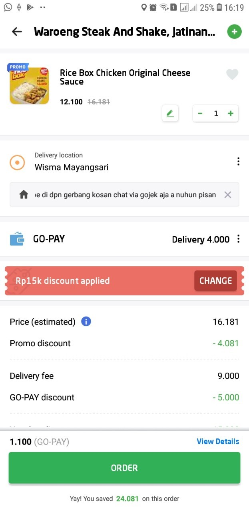

# First Try GoFood Delivery

Since I liked to use GoRide to go to college rather than the traditional ojek anymore, I got a sum of balance as GoPay in my account. Today, I tried to use GoFood delivery service because I got notified that I got a very promising voucher to use.

Thanks to the voucher, I could buy this food for a very low price. Only 1,100 rupiahs! The food was not really worth but I felt great since the price was still reasonable. The delivery service is okay, I could track where was my driver and when would he come. Maybe I should try GoFood again later, if only I could get more promising vouchers.

