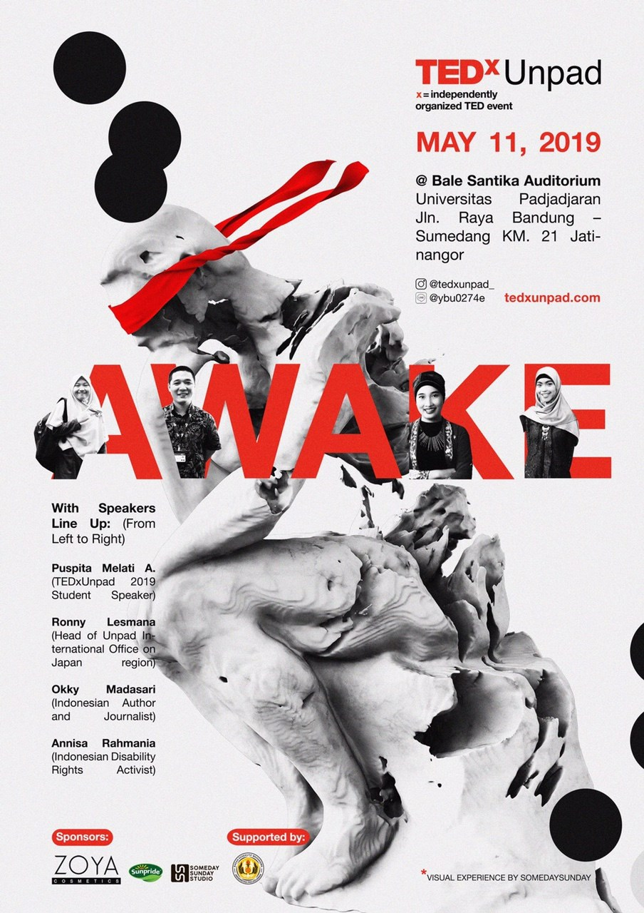

# TEDxUnpad

[TEDxUnpad](https://www.ted.com/tedx/events/32314) was a cool event. Of course because it got "TEDx" on it. TED was a popular media organization which usually held a conference and invited random people, could be popular people or just regular people, who had great ideas to share. Each conference had a topic. TEDx was an event branding which was held by people not from TED but got permission to use TED. Because we held the event at Padjadjaran University or Unpad, we named the event TEDxUnpad. Well, I'm not good at describing things sorry. I'm too lazy to google the definitions.

Today was the main day. Before that, TEDxUnpad had held a pre event on March 16, 2019. Too bad because of some problems I couldn't go to the pre event. Well, the pre event didn't need me though, as the design division we did nothing on the pre event. On the main day, the design division members got some jobs to help the event division. I got the position to maintain the screen aka operator. It was easy but boring. I once got a stomach ache and I need someone to replace me but no one could help me damn. Fortunately, the stomachache was not too bad so I could hold it until the end of the event.

The decorations of the event were so damn cool and aesthetical. I wish I could see more events with decorations like this. Well, I also wondered where the hell did we get a lot of money to pay for these awesome decorations?

There were 3 invited speakers and one speaker who was a student of Padjadjaran University and chosen as the best speaker from the pre event. Sorry I'm too lazy to describe every speaker so in summary, the speakers were awesome but I wasn't sure if this event was worth it for people like us. I meant, to join this event, the participants should pay for a quite expensive ticket and they were tricked into thinking that we would get the most wanted speakers from the wishlist post when in reality, there was only one person from the 3 invited speakers who was really from the wishlist and he was not one of the most wanted though. He was dr. Ronny, the head of IO Unpad. He was chosen because Senior Rhe was in the curator division. The curator division was responsible for choosing the speakers by the way.

In the end, we took a photo together with the whole volunteer members. Wait, this isn't the end!! After cleaning the area, the whole volunteer members were gathered and we were told that WE WERE IN DEBT. What the hell dude. Is that because of the decorations? Not just that. But almost every aspect from the event was not paid. Jeez, the project officer wanted us to help the money problem. Okay, stop it. I don't want to talk about it again.

By the way, TEDxUnpad had overloaded lunch boxes and snacks! And because we had to pay the debts, the lunch boxes and snacks were not for free and we should buy them. Hah, I doubted that it would be easy to sell foods that should be eaten for lunch as dinner. Although I hoped that if I waited patiently I could get the foods for free, I still buy them because I wanted to get back to my place as soon as possible. I was more afraid that rather than getting them for free, I should buy the leftover boxes till they were sold out.

