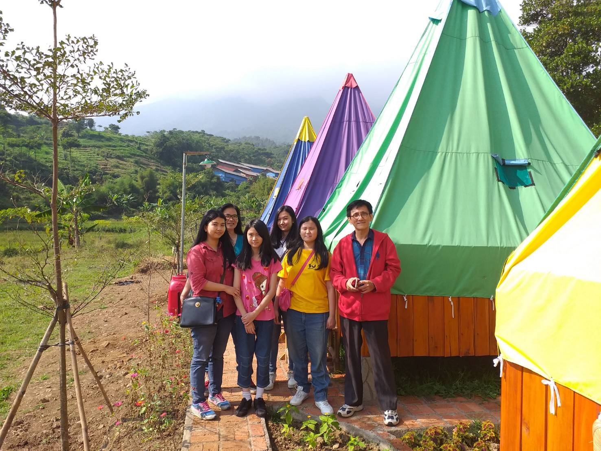

# An Unusual Family Trip

I don’t know what to tell for this month’s blog post so I will tell this family trip instead.

My dad got an invitation as an alumni from Bogor Agricultural Institute to join a 2-days reunion party. Everyone could bring their family and because this event was already well prepared so we didn’t have to pay on anything anymore which meant people could go inside, eat and join the sleepover for free.

The venue was in Bogor Tenjolaya Park. It was still new, so there’s not many people who knew this place. The place was big and full of deers. I didn’t check if there are more animals besides deers. Because the place was still new, the access to get through the place was hard. We had to walk up and down \(because of hills\) and it was tiring. That’s why we didn’t want to explore too much and we only saw deers. By the way, we took this photo together.

There was a hut as the party’s venue. Because it was already lunch time, we enjoyed the foods that were already prepared by the party’s committee. Great, the lunch was delicious.

My dad was enjoying his talk with his colleagues a lot while the other family members including me ignored anything and just sat quietly. After lunch time, the alumnis had a game time. They had to make a standing row with ordered body height. My dad's team didn't win. Then he continued to talk and talk and talk and talk until the afternoon came and my family and him asked for a permission to get home earlier than others. Actually my dad waited for a family to get home before us so that we didn't look like we refuse to join the sleepover party.

Finally the trip was ended and we went back home.

