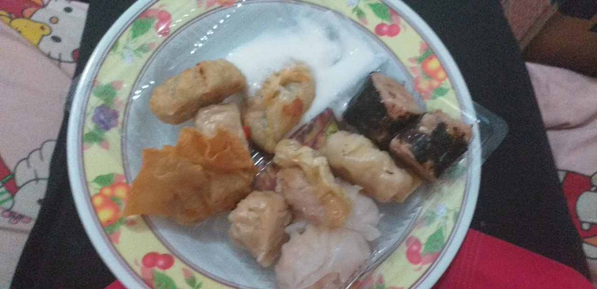
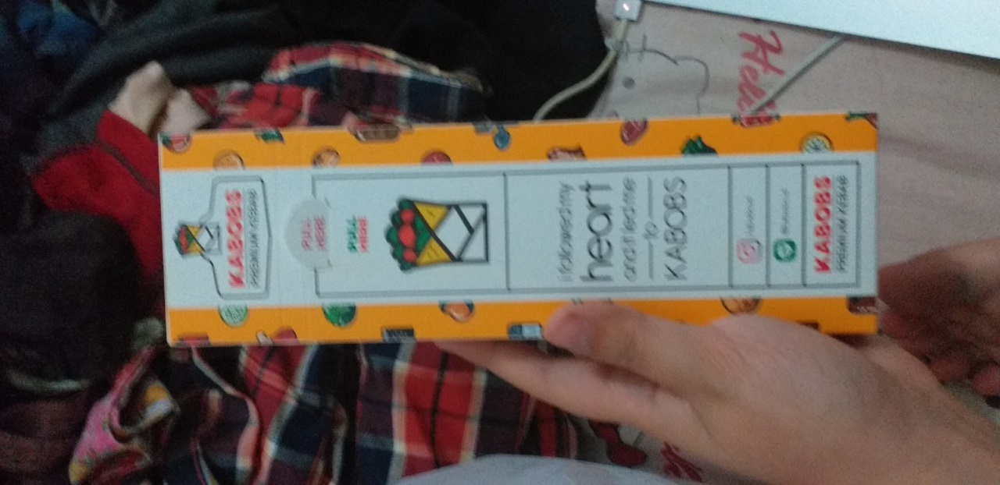
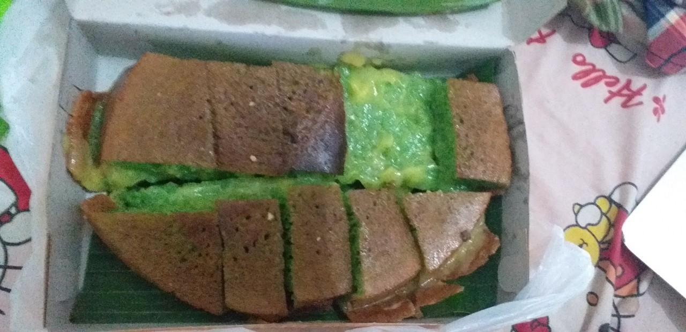

# Food Diary This Week

This time I would like to review Mr. Dimsum, a dimsum delivery service that I used today. Well, this wasn't the first dimsum I tried in Jatinangor by the way. I don't remember if I told you about Halo Dimsum that I'd eaten before but I would say that Halo Dimsum wasn't worth it. Mr. Dimsum was the same. But I had to admit that I preferred Mr. Dimsum although it was expensive because there were so many variants rather than Halo Dimsum.

Eating dimsum made me remember the time when I was in an all-you-can-eat dimsum restaurant with my family before. If I wasn't wrong, the restaurant's name was "Bambu Dimsum". I hated the service quality but where would we get to see an all-you-can-eat dimsum restaurant again besides this? I want to go there again if there's another time. I don't care if the service quality is bad, as long as they don't set a duration for each order, I will stay there up till night haha. I said that the service quality was bad not just because the waiters/waitresses were so slow, but the order of the dimsums they brought was also so wrong in many ways. That's the reason why I couldn't eat as much as I did in all-you-can-eat restaurants that I had before. They shouldn't bring fried and steamed dimsums randomly. I was sure the steamed dimsums made me full too fast. Ah damn. If only that restaurant let us take the dimsums by ourselves.

Back to the Mr. Dimsum review. LOL sorry I talked too much about Bambu Dimsum restaurant. Well I am not a good reviewer though so I couldn't say anymore to review it. The photo of Mr. Dimsum that I bought was above.

Ah yes because this post is a food diary so I will also tell other foods I ate. I craved kebab from Kabobs in Jatos. I bought full beef kebab via GoFood. Well yeah this was so tasty but I would be broke if I bought this too much.

I also ordered pandan doughed martabak with cheese and corn flavour because I wanted to eat corn so much but I didn’t find any in GoFood. I was quite disappointed because the corn in the martabak was not so many LOL.

By the way, sorry for the bad quality of the photos I took.

