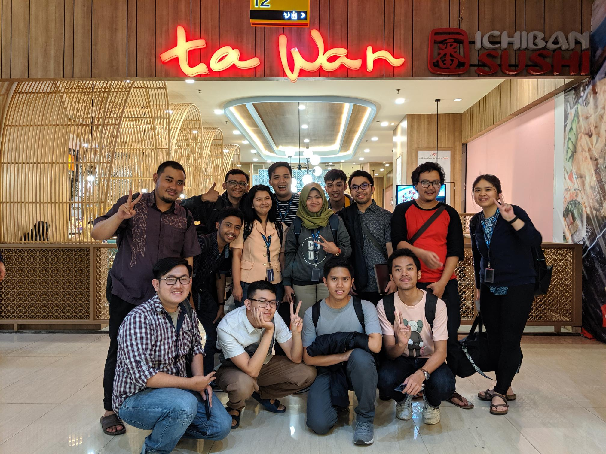
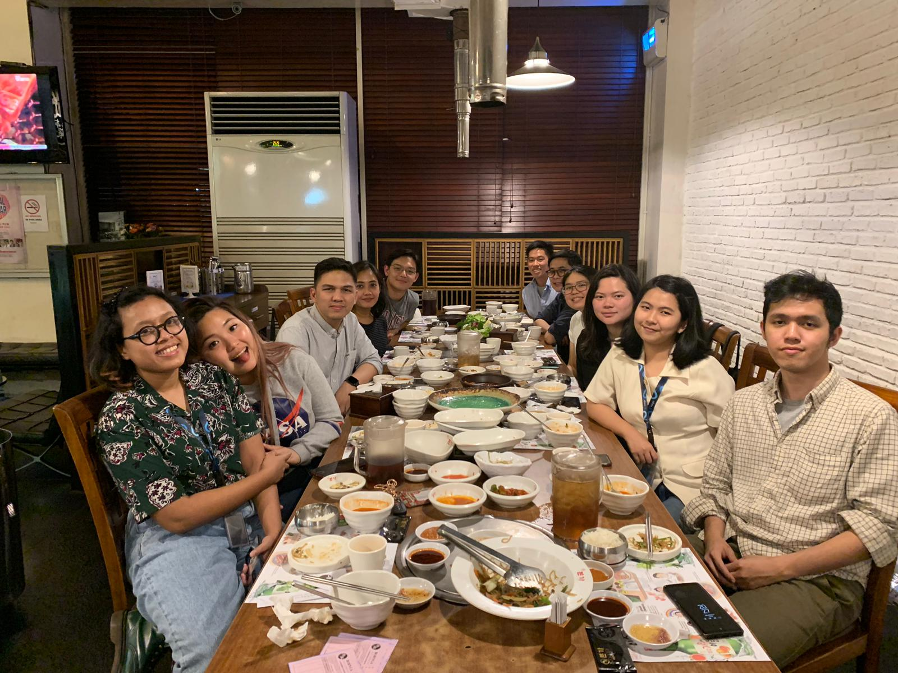
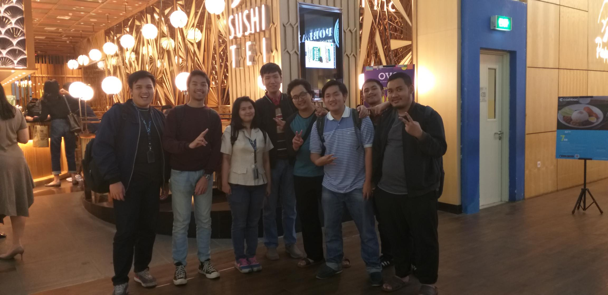

# Foodie After Work Compilations

Before we start the serious post of my Kargo's second internship season, I would like to tell all the foodie time I did with my co-workers outside the office. I will tell the story in order and I hope I don't miss any story.

#### Justin's Last Day Feast \(Kintan Buffet\)

Justin was an intern in Kargo just for a very short time. He just came at the same time I came back for the second season and then he ended the internship only about a month. On his last day, he invited some of us especially from the Engineering team to join his last day feast. We went to Kintan Buffet. I heard about this restaurant for a long time but this was the first time I went there. Not only we were invited but Justin also treated us for free! Dayummm it's more than just BBQ time. Kintan Buffet didn't just provide us fresh meat but also Japanese foods and sweets. We could find cakes, sushi, chawanmushi, and even we could get pasta\(?\). The fresh meat that Kintan Buffet provided had to be roasted by ourselves. There was a flat stove on our table to roast the meat.

We were kinda messed up because we didn't check the time. Kintan Buffet had a rule to only stay for 90 minutes and we couldn't leave any leftovers. Because of this, it seemed that Justin had to pay more. Well, he's a crazy rich so it wouldn't really hurt for him? There were a lot of people joining this party and he paid for all of us were already too crazy. Here's the photo of the feast!

After that, some of the people still continued the party in a billiard arena but I decided to go back home.

#### Before Jais Went To India \(Ta Wan\)

Jais was chosen as the delegation of Kargo to India. He would work in the KeyValue office in India. It's similar with student exchange but for a full time employee. Not only Jais, Yodi and Mario would also go there. Yodi and Mario would go there to recruit more Indian engineers but Jais would be put there to work with KeyValue engineers.

Before Jais went to India, he asked us to hold a little feast. We went to Ta Wan, a Chinese food restaurant in Pacific Place. At first I didn't want to eat but seeing everyone order something I couldn't resist it. We also took a photo together!

By the way, Ta Wan was also the place for Ivdur and Rosa's last day feast! But they didn't leave for now. The time should be around before Ganen left. Too bad there's no photo taken.

#### Kargo Product Team Dinner \(Pagi Sore & Bornga Korean Restaurant\)

Kargo Product Team held dinner time twice. The first one was in Pagi Sore Restaurant and the second one was in Bornga Korean Restaurant. The first dinner time had already been done before Anna left. There was Tiorys who just joined the Product Team and this dinner time was her first introduction to everyone. Pagi Sore Restaurant was a restaurant of Minang cuisine. I had to admit the food was super delicious. It's different from just other Padang rice I found in my neighborhood and Jatinangor. Rangga even said that his mouth couldn't stop eating all of the food. There's no photo taken for this dinner time. I guess that's because there were a lot of team members who didn't join this dinner time.

The second one was held after Jais went to India. I actually didn't really remember the specific time and that's why I just said the timestamp. Bornga was a Korean food restaurant. The main dishes were delicious but I didn't really like the side dishes. I didn't know the name of the side dishes unfortunately, but that wasn't kimchi for sure. This time, Kargo Product team members joined except Ivdur jeez. Here's a photo of the Kargo Product Team. I wished I could add Ivdur there so we would be complete 🙁

#### Kargo Product Designers Dinner \(Mr. Bitsy\)

Not only Kargo Product Team but Kargo Product Designers had once held a dinner time. Product Designers consisted of Tiffany, Meta, Ivdur, Ilham and me. Yeah finally Ivdur joined a dinner time. We almost wanted to kill him if he missed this dinner time. Rangga also joined the dinner time because he was the head of the Product Team. We held it in Mr. Bitsy, a little restaurant in SCBD. It's actually like a bar but they provided regular food as well. Tiffany bought a bottle of soju and I was surprised because it tasted good. We didn't really have a serious conversation topic and we even brought old embarrassing moments. Here's the photo of that dinner time!

#### Ganen's Last Day Feast \(Marugame Udon\)

A week after Rosa and Ivdur left, Ganen went after them. Ganen held his last day's feast in Marugame Udon. Most of the people who joined the feast were part of Kargo Weebs including me haha. I never went to Marugame Udon before. I even just heard that name that day. The udon was good. They also provided us with refillable drink. Most of the conversation topics were about the stake of the engineers life. We were betting on who would leave Kargo Engineering team first. We were also talking about weaboo stuffs LOL. Here's a photo of us! I will miss you Ganen, my gay jokes pal 😭

#### My Last Day Feast feat. Edwin \(Sushi Tei\)

Finally the last foodie time! Of course it was my last day feast. It was actually Edwin's last day but because I still didn't want to go too soon, I decided to extend my Kargo onsite internship. I feared too much and hadn't talked about extending my Kargo offsite internship to Tiffany or Rangga. We celebrated this a day before our last day because Edwin had to fly to Surabaya on his internship's last day.

Edwin and I discussed the last day feast together. We decided to go to a sushi place. We did some research and decided to go to Sushi Tei. We could treat a big package for everyone who joined the feast. I actually wanted to invite Tiffany but I was late and Tiffany said she had somewhere to go after work. And yeah there's no female again like in Ganen's last day feast beside me.

At Sushi Tei, we ordered more than we discussed before. But Edwin said he would pay for the other menu that we didn't discuss. I was happy to be in this environment. To be honest, because I joined some foodie time with the Engineering team, I became close with people I never thought I could befriend with such as Fersandi, Ariz, Wibi, and Elang. I really miss talking to them again in the future. Here's the photo of us! There weren't many people joined but it's okay because I couldn't think of how to treat many people hahaha.

And that's all my stories about foodie time with co-workers. I also joined in Jin's last day feast but I didn't remember where and when it was. Also, there's no photo of it. There weren't many people who joined the feast too because it's too sudden. Now it's time for me to tell my internship story season 2 after this post.

