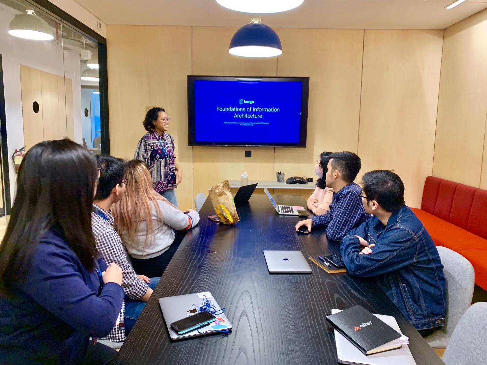
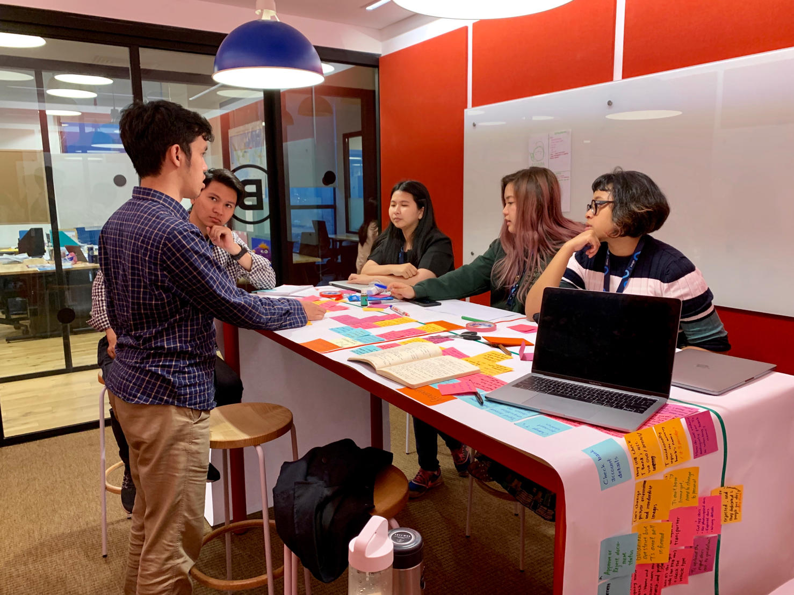
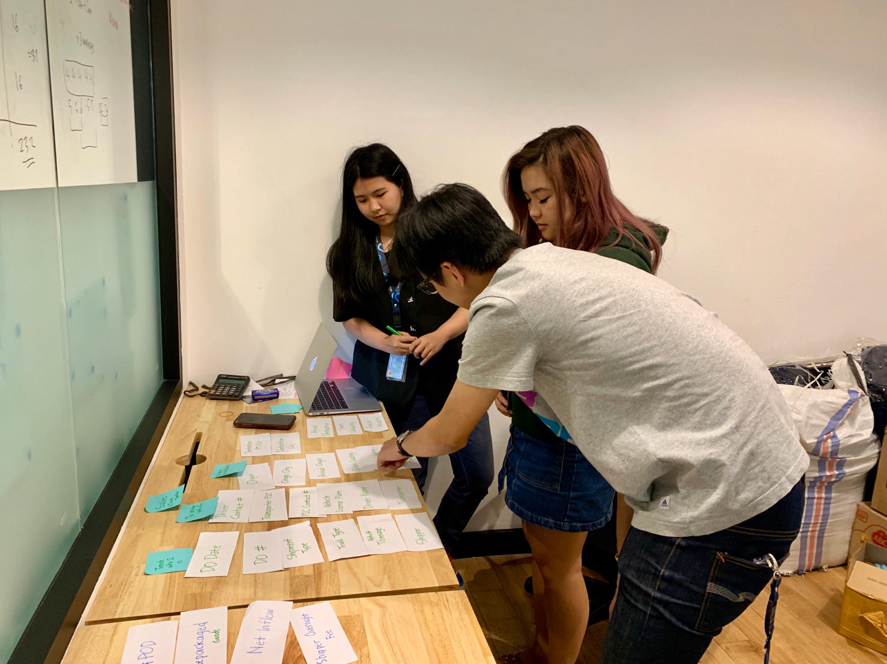
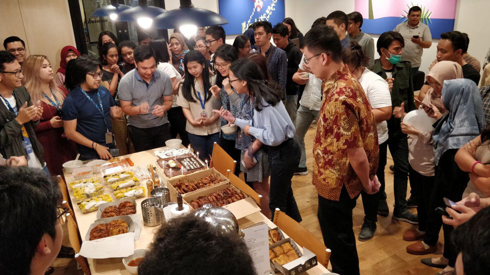

# Kargo Season 2

The most awaited time is coming now. Here's a story of me in Kargo for the second time of being an onsite intern. I won't tell much here because I need to finish my internship report as soon as possible.

I went to the office along with Maggie's car on my first day of my internship's second season. There were a lot of new faces in the office, especially in the Product Designers team. I thought Ivdur and Ilham were full time employees but they were interns like me. It's also my first time to see Tiffany in person. Tiffany told a lot of things such as the design tools that we would use and many more. We were going to use Sketch and Abstract. Sketch was used for designing and Abstract was used as Git tracking for the designs. Ivdur, Ilham and me took a photo together for Abstract account's profile photo.

On my first day, I was interviewed by Tiffany about what I wanted to learn in this season. I told her I liked to deepen my designing skill. Tiffany also gave me a lot of books as my references. I had to make a summary for those books and it became my first job in this season.

It's impossible for Kargo employees, especially the Product Designers team who I just met, to know that my first day coming back to the office was also my birthday. But I was surprised Ino knew and he congratulated me. There were some employees from the Operations team that I knew from the first season followed Ino to congratulate me. Even though I was congratulated in public, the Product Designers team didn't see it so I was kinda sad in my heart.

I had a lot of things that I learned from this season. It really helped me a lot in understanding how the real product designer worked. Thanks to Tiffany I could learn faster than the previous season. I learned that UI/UX was not just about designing but also the methods on user research, problem solving, testing, and many more. I couldn't explain it one by one here, sorry. Here are some photos of me and the Product Designers team working on Kargo's products.

Paperpillar didn't work for Kargo anymore and Kargo held all the products by ourselves. Kargo products were increased and we decided to split into two. Meta and Ivdur handled Kargo product designs in the Commercial team aka Panthera while Tiffany, Ilham and me handled Kargo product designs in the main team. Wait, I could be considered as the person who handled the Marketing team's ridiculous shits.

Almost all of the tasks that were assigned to me were to handle designs for marketing team's needs such as promotional banner, new webpage design for a campaign, etc. I remembered there's one time when Claudia was angry at me because I didn't follow her rules. Claudia was in a high position in the Marketing team. I almost cried damnit. She yelled at me and everyone in the room was asking what happened with me and her. She acted like designers were slaves for fulfilling her needs. She asked for revisions directly to the Engineering team who coded the webpage without Product Designers team's permissions. That day, Tiffany was not coming but she supported me when she heard about it from Rangga. I felt relieved for a while. I was glad Tiffany cared for me as much as other product designers.

I also developed hatred towards Danang because he acted like a loser who just followed his supervisor without saying anything. I might not say I hated him but he really pissed me off and I decided to avoid him as much as possible. Sorry Danang, we couldn't be a friend till your last day. I was not the only one who disliked him though, even by his colleagues.

At the end of June, Kargo celebrated a birthday celebration for the employees who had birthdays in June. Here's the photo of the party.

At the end of August, Kargo held a special party for summer interns. I wasn't one of the summer interns but I was invited as well. There were fun games like true or false about Kargo and guessing Kargo employees from a piece of photo. Then the interns were given a rose and we had to give the flower to any Kargo employee. I gave mine to Giovanka haha. And then I became awkward when I was asked by Maggie, the MC of this party, why I gave mine to Giovanka. I just said, "Well, he was the first person I met in this internship season." Although it was supposed to be Maggie since I went to the office along with her LOL. She was the MC and I couldn't give mine to her. There was a lot of food after the party.

If there's a meeting, there will be a departure. I met a lot of new people but I couldn't help saying goodbye to them. All summer interns were leaving one by one. Justin, Erwin, Zhan, Rosa, Ivdur, Ganen, Edwin, and many more that I can't mention one by one... don't forget me. I will just tell some people based on photos that I have.

I might not have known Justin for a long time. Whenever I talked to him, I didn't feel that we were matched. He often said that I was beautiful and I honestly hated that kind of boring flirt. But I guess that's how he is. His extrovert level is too high, even a person like me could feel ease around him. He was here as Program Manager Intern along with Rindu. Well I didn't know there's such a position like that, I wished I could be in that position. I talked a bit with him even after he came back to the US, yes he lived and went to a university in the US. I even met him again at the GoFood Festival near our office even when he's already resigned. I thought he was already in the US but turns out he was still here enjoying his holidays in Jakarta before going back to the US. Anyway, thank you Justin for the treat at Kintan Buffet haha. I hope I can meet you again if I succeed to get a scholarship in the US.

There was also Erwin who left early. Similar to Justin, he was too extroverted. I could see he was even closer to Tiffany rather than me. I thought he knew Tiffany for a long time but it's wrong. It's just because Erwin liked to go to parties, especially when Tiffany was there drinking all night. He was the opposite of me. He could make everyone in Kargo miss him so much. Some people including me took a photo together as a farewell for him. I didn't and I will never get a chance like this. Same as Justin, I still talked to him even though he already left, but Erwin seemed to like to chat with other people especially from the Engineering team.

Rosa, Ganen, and Edwin are my one pack gang. Rosa is the innocent one and Edwin is the careful one. They both have a similar feature that makes me feel at ease around them. Ganen is the special one, because he is the perfect type of friend that I like. We all sat closely with each other. Rosa and I became closer because we worked for the same project from the annoying marketing team. At first, she looked like a quiet person that I disliked but slowly she began to be close with everyone including Tiffany and Meta. I was kinda jealous of her because Tiffany and Meta seemed to like her more than me. But I still respected her and we still chatted with each other even after she left. Edwin and Ganen were always together. They both were from Technology Institute of November 10th. I usually opened a conversation with them about how much GEMASTIK sucks this year. I learned a lot about programming from Edwin while I got a lot of jokes and memes that I liked from Ganen. I hope I can keep this relationship strong.

Ivdur was one of the members of Kargo Product Designers Team. He was actually the first employee I met after Maggie in this season, but he wasn't a full time employee LOL. Do you want to know what's my honest opinion about him? I hate him. He was very cocky especially when he got a protection shield from Meta. Every time I tried to please Tiffany and Meta, Ivdur ruined it, including when Ilham, Ivdur, and I planned to buy some gifts for Tiffany and Meta. Then Ilham made it worse. Sometimes I felt Ilham was on my side but when Ivdur showed up, he talked as he was on Ivdur's side. That just sucks. Well, it's true that I hate Ivdur but I still respect how skillful he is. If only he isn't cocky, I think he could be a good role model. I hope I can be more skillful and please Tiffany better.

Ilham stayed at Kargo office as a part time employee. That being said, he still had to go to the office on his workdays, not offsite working like me. Ivdur chose to leave Kargo after his internship period ended. I heard the rumor that he got a golden ticket from Tiffany. If he applies as a full time employee he will definitely be accepted. Ah yeah by the way this is the photo of Tiffany and her triplets. It was taken on Ivdur's last day. Meta didn't come to the office on Ivdur's last day, that's why she wasn't in the photo.

The last person that I want to tell is Zhan. Actually he already left before Rosa, Ivdur, Ganen, and Edwin but I put our story last because of some reasons. At first, I didn't really like to be close with him because there were already two highly extroverted people around me \(Justin and Erwin\). Erwin had already stolen Tiffany's heart and then Zhan also came to make Tiffany laugh. Zhan was in the Product Team and he was a Product Intern, yes that's his position. Although he often made mistakes and asked a lot of annoying questions, Tiffany never got mad at him. Her reaction was different towards Anna, Iskandar, or any other Product interns, even Ivdur, Ilham, and me. I really hated that kind of person because he stole too many spotlights from Tiffany.

Then we became a partner for a special project arranged by Rangga. I was picked to handle Kargo website's engagements along with Zhan and I had to move my seat beside him and Rangga in the other room. Zhan really helped me so much especially when we had to debate with Claudia, Tiffany, and Rangga. This job was actually crossing the line. I was no longer working as a designer but also coding. I should make a new website design as fast as possible then immediately code and publish it to the public. Sigh, this was challenging but tiring so much. I managed to redesign the homepage and blog page. Sometimes I helped fix old Kargo website \(the price check feature\), corporates, career, and vendor page even though they weren't perfect. While I was busy with designing and coding, Zhan helped me to get information about the engagement. We had our engagement target and there's a TV screen to display the engagements everyday. Zhan and me became closer than anyone else in less than a month because of this project. And I felt sad he had to leave early. Here's a photo of us on his last day. By the way, he held a last day feast but he went to a bar to drink and smoke and that's why I didn't join.

After Zhan left, I could feel that my progress grew slower than before. I was uncomfortable with the loneliness and it made me often visit my origin room to see Rosa, Ganen, Edwin and everyone else. When I was in the current room \(with Rangga and Zhan's desk\), I usually talked to Shabby, Sandi, Wibi, Elang, Kebi, and everyone else. This room was quieter than my origin room because there were Tiger the CEO and Yodi the CTO in this room. But that didn't make the residents feel under pressure. Sometimes, when both CEO and CTO weren't in the room, we spoke rudely LOL.

The working days were passing day by day. Weekend was my favorite time to sleep all day and every morning on weekdays was a pain. Finally, when I asked for another offsite internship, I tried to consult Tiffany and Rangga. It required a lot of courage and I almost died to face this fear. Rangga said he only approved if Tiffany said yes, but Tiffany already left and said that I shouldn't continue my internship anymore. After a lot of persuasions, I finally got her approval. I was happy and couldn't wait to work hard to show how serious I was.

That's it. It's the final day of the second season. I hope everything goes well with this offsite internship opportunity.

