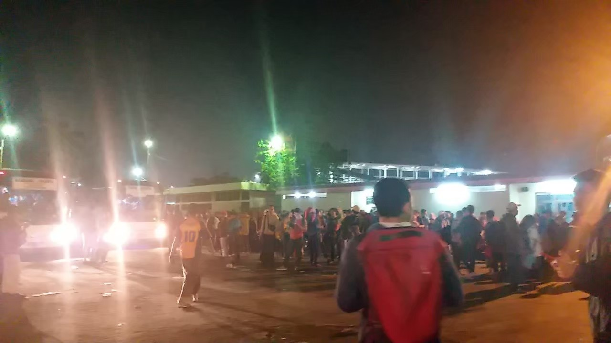

# A Very Good Bye, Kargo

I had my own reasons why I decided to resign from this internship. No, I don't hate anyone including Tiffany. I admit, she is my role model. She has a lot of similarities with me in personality. Even though she was heartless, she wasn't wrong. Yes I was sick and then she didn’t say get well soon but instead asking me when would I reschedule. Yes she gave me a ridiculous amount of tasks when I only had to work for three days. But I didn't deliver good results and it made her mad. I was tired, that’s the real reason. I lost my passion to work or do anything.

I am also tired of my annoying father who always calls me to tell me what to do. Sigh, I know very well what I should do, he doesn't have to lecture me damnit. Lately, I cried a lot because of my father's arrogance. I told him I was tired and I couldn't focus on my college tasks and that's why I wanted to quit the internship. I was stressed but he just said, "Don't be stressed". Tch, what a wonderful suggestion indeed. He didn't allow me to quit and force me to continue the internship at least until the end of the year. He said that I could get more allowance if I stayed working for a year in Kargo. Jeez, at the time like this he still thought about money. In the end, my decision was absolute to quit as soon as possible. My father called me just to yell and yell. He never agreed with my decision and just said, "Do whatever you want."

The more I became stressed with the offsite internship tasks and the more my father called me, the more I hated myself. I swore too much lately just to relieve my stress. To be honest, I even blocked and ignored my father's calls because I was tired of his annoying lectures. You know what, even after I quitted he forced me to find another internship job or asked me about the thesis progress or the scholarship that I wanted to get. He definitely didn't understand the real reason why I quitted goddamnit!!! What's on his mind was just money and money. Sigh, what a toxic parent that I have.

Two days ago I went to Jakarta for Icompas and today I went to Jakarta again by myself just to give back my macbook to the Kargo office. I hated my father because he didn't let me see the office again for the last time. He forced me to give back the macbook via delivery service and let the HR team pay and dealed the package on their own. That's very rude. As a person who worked offsite and suddenly wanted to resign, I needed to say goodbye face to face so that I went to Jakarta without telling my father.

I arrived in Jakarta very early because I wanted to find souvenirs for my work colleagues. I thought of aromatic candles but I couldn't find a local shop to buy it easily. I went around to see the local shops that I found in Google Maps but I couldn't find any. I also tried to go to malls but unfortunately the size was too big and the price was too high. I wanted to buy a lot of aromatic candles and it's okay if it was small. I saw a lot of small aromatic candles in online shops like Shopee, Tokopedia, and Lazada but none of them had a local shop that I could visit. They also couldn't send the packages on the same day without using GoSend/GoBox which was too pricey for me.

At the same time, I had to deal with the Kargo Product Team's hoodies. It's good news that they could deliver the hoodies on the same day with my arrival in Jakarta but they arrived too early before I could go to the office. I asked Maggie to pick the hoodies. There were a lot of problems with my communication with the courier and Maggie was also busy in the office but finally the hoodies were picked safely.

Because I was already too tired so I gambled and went to Grand Lucky Market instead. It was located near my office and I was shocked because I could find the aromatic candles that I wanted there. Damn, if only I came here sooner. I wasted too much time going around Jakarta while I could just buy these easily there. After buying the candles, I spent about an hour writing the messages for each candle. I went to the office around 5 PM and the employees already started to prepare for Friday night. I forgot that today was Friday and some of them liked to have a party after work. I succeed to give some of the aromatic candles in person especially for Yodi, Rangga and Maggie who got the special candle. Tiffany and Tiger also got the special one but I couldn't give it in person because they already left. There were also some little aromatic candles that I put on the desk of the people that helped me in my internship seasons. At first I thought the aromatic candles that I bought were too many but after putting the spares on the engineering desks, I failed to give some of them to the Operations and Marketing team.

I gave back the macbook to the HR team. I didn't reset the OS but at least I erased all of my documents there. I also lost my access to the office email, Atlassian, and Microsoft Teams. I succeeded in talking with some of my work colleagues who hadn't left yet but I didn't have much time since it was already night and I wanted to go back to Jatinangor immediately. I went to the bus terminal with Giovanka for the last time and I was lucky to find him when he wanted to go home LOL. Goodbye my workplace crush, I hope you don't forget me.

I managed to reach Primajasa pool on time but damn there were a lot of people there. I didn't know why because there wasn't any long holiday or anything. I had to queue up to catch the bus. At first I was patient but around 9 PM I decided to cut my queue by choosing to sit in the smoking seat area of the bus. Luckily, there were some good people who let me sit in the normal seat area. I felt bad for the person who gave me the seat though. I slept in the bus for a while and finally reached Jatinangor safely.

