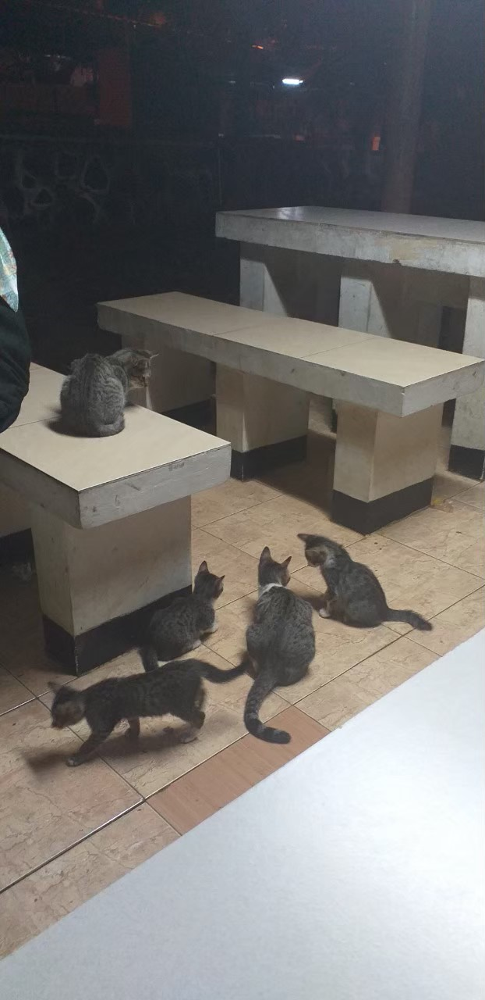

# These Cat Family Annoyed Me

Today was very annoying because I couldn't do my homework in my room since I had to deal with the lights out. It was okay if it only happened once but guess what? It was twice a day! I didn't want to deal with other lights out so I decided to go to my faculty's gazebo. I was actually late because I went there when the sun already had set. This decision was also too sudden and I didn't have time to invite anyone to accompany me.

The gazebo was very quiet and that's rare. There were two female students and I guessed they were Biology students since they talked about their Biology building. Also there's a male student who ate Hoka Hoka Bento. Ahaha I looked like an observer here. Actually that male student was annoying because the Hoka Hoka Bento that he ate made me want to eat Japanese food too so I ordered rice and katsu to fill my stomach. Well I almost forgot that I hadn't eaten anything tonight.

Too bad I couldn't concentrate on my jobs because there was a big cat family that invaded the gazebo! The two female Biology students knew so well about the cats especially the big female one which was the mom. The cat mom even had her own name which was given by the Biology students LOL. When I told this to Mila, she told me that the cat mom was very popular because she had a pair of beautiful eyes. I agreed with that LOL.

There were three kittens which walked around their mom. I guessed they wanted to get something to eat from the Hoka Hoka Bento that the male student ate because his eating session was disturbed by the kittens LOL. They also disturbed me when I ate my food that I ordered before. I gave a bit of my katsu but the mom was very selfish LOL. The kittens didn't get any bite.

The wholesomeness didn't end there. There was also the cat dad LOLOLOL. All of them had the same color! Wait...is that the dad or one of the cat mom's kids which already got big? Cats definitely had the most complicated family issue. God, how did I suppose to work in this environment? It's like a cat cafe here. Damn, I can imagine if I go to a cat cafe. I will definitely get distracted by the cats!

Too bad that suddenly I got dizzy and I decided to go back to my temporary home as soon as possible. I also heard that there won't be any lights out. Shit, I failed my mission to do my homework. I only came there to observe the life of a cat family. I couldn't help with the sickness that I felt so.. yeah this is so sad.

