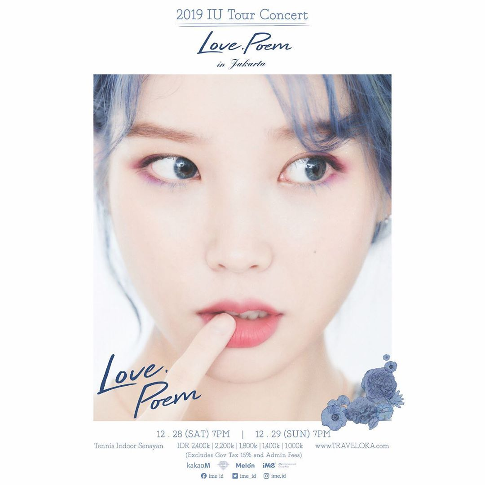
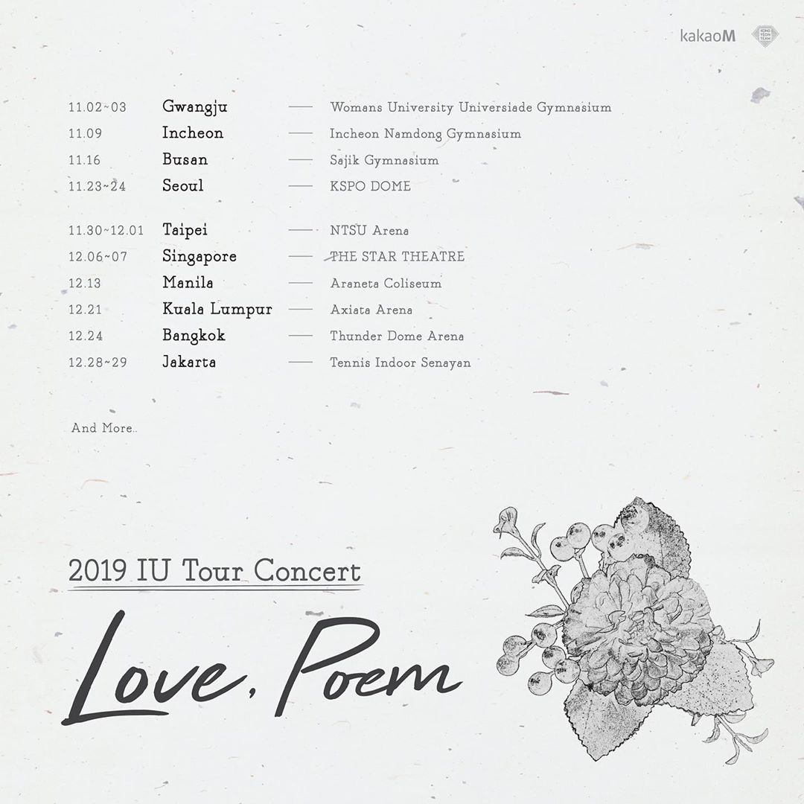
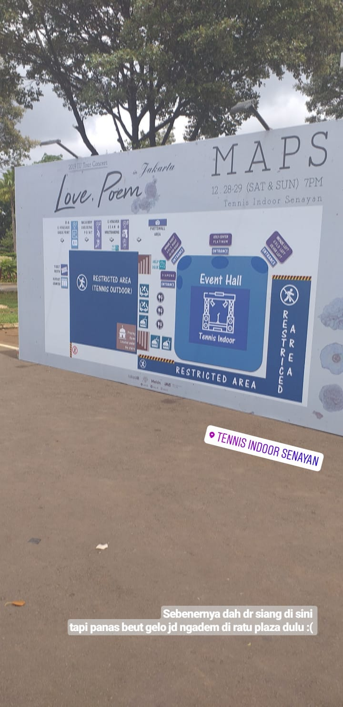
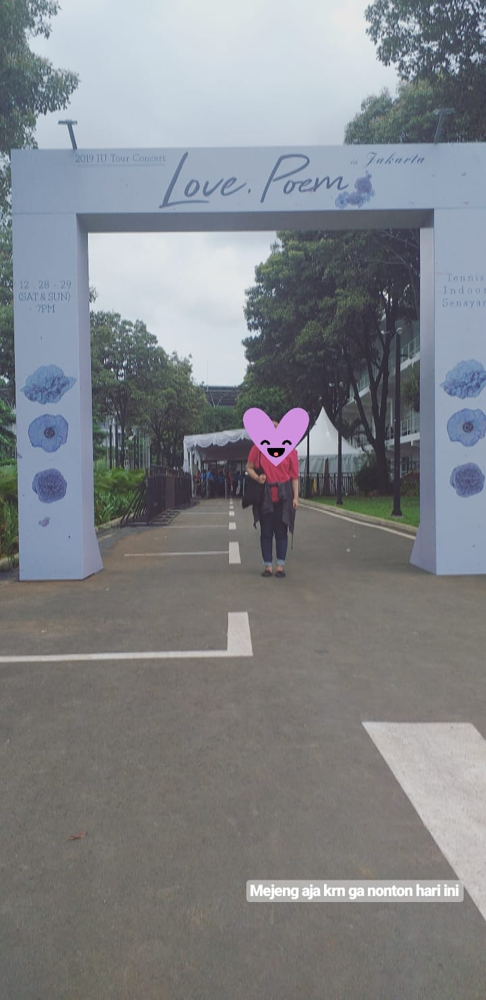
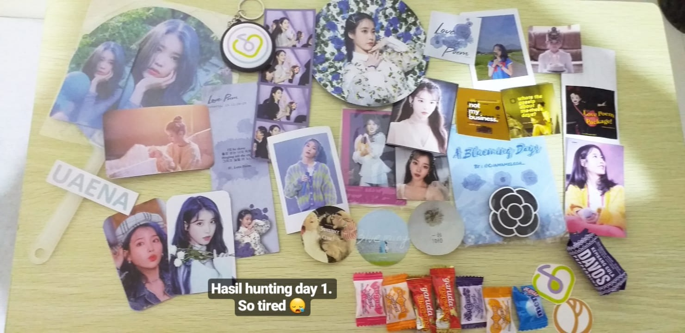
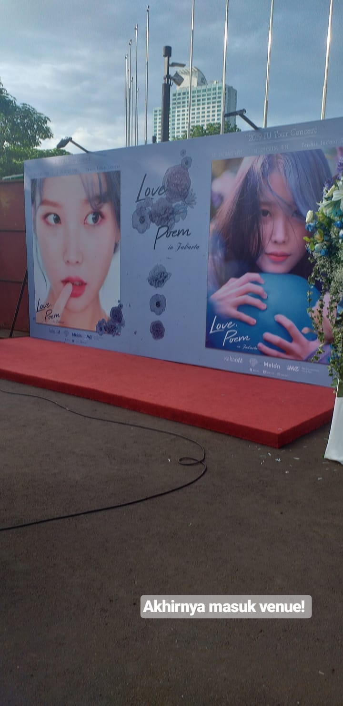
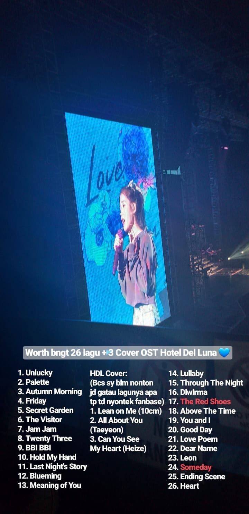
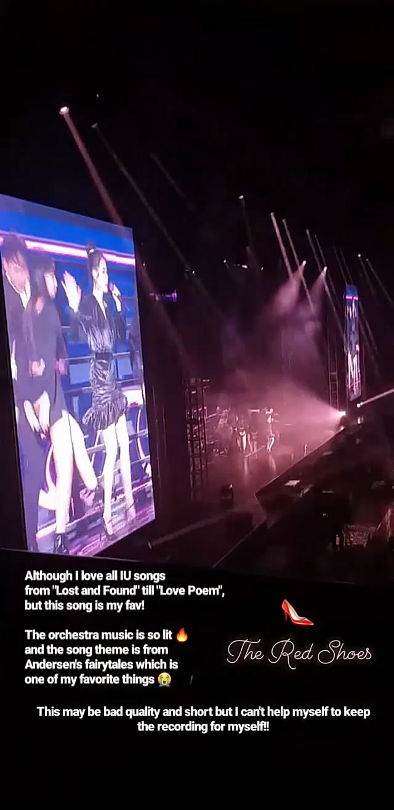
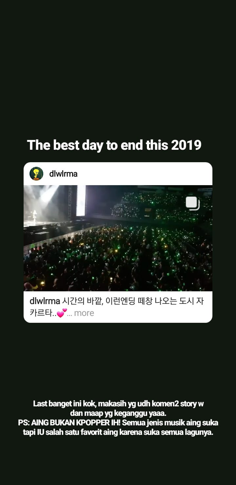
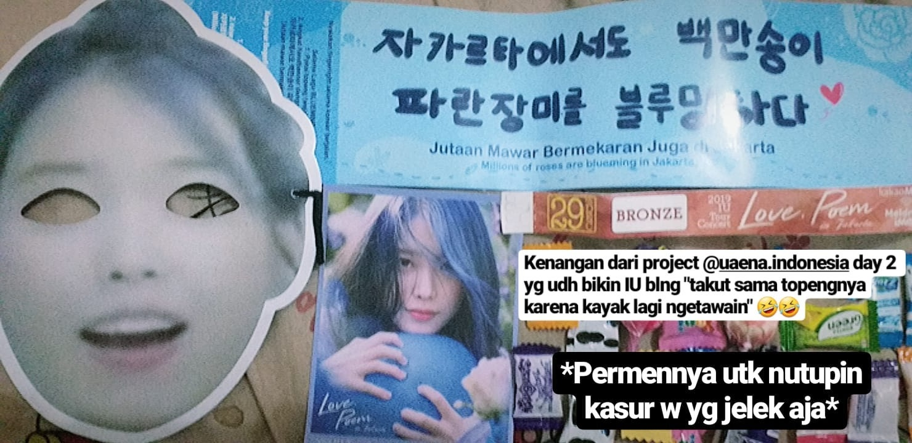

# \#IULovePoeminJKT

Even though I got fraud because I bought IU's ticket before, I still wanted to go to her concert. I couldn't think clearly if I couldn't see her. What if I won't get another chance to meet her anymore? I decided to use [Net Business](https://www.instagram.com/net.businesss/) as my ticketing service. It was recommended by Senior Ojan and Vega. It was more expensive than the original price and the price that I got from the fraud but I wanted to believe that this ticketing service could be trusted. Net Business' service was lame. The admins responded slowly and it made me worried at first.

IU was on "Love Poem" tour to Jakarta from December 28-29 but she's already in Indonesia from December 26 though. There were [some photos](https://twitter.com/patricia_joanne/status/1211002322840510464) and videos on Twitter when she arrived at the airport. I came to Jakarta on December 27 and stayed at a cheap hotel for two nights. I got the concert ticket for day 2 but I still want to come on the first day to hunt some fan freebies.

I got my first experience using an electric train, or in Indonesia it's called KRL, and monorail train aka MRT. I had a feeling that I had visited Tennis Indoor Senayan when I was in high school for my school's concert Revival, but damn I didn't have a clue that Tennis Indoor Senayan was inside Gelora Bung Karno \(Bung Karno Sport Center\). I thought I was strong enough to walk by myself but that day was very hot so I used GrabRide service to go inside and outside.

As I told before, I came today to get some freebies. Several days ago, I already compiled all freebies that I could hunt for the first and second day of the concert in a checklist. I also made [a thread](https://twitter.com/patricia_joanne/status/1208729655512952835) to help me track all the requirements for getting the freebies. Most of them required us to retweet and like. I disprioritised some freebies that were impossible to get especially if the freebies were limited or for trading only. I didn't have something to tell more about today besides hunting time. Oh well I took some photos. I only stayed here until 6 PM and then I went back to the cheap hotel.

I went back to the hotel in similar ways but reversed the ways I went to Tennis Indoor Senayan. At the hotel, I organised the freebies that I got from today's hunt. Here's the photo! I also tweeted about it on my Twitter as a thank you. I liked the flower popsocket the most. If I was late at figuring out where the person who shared the popsocket was, I wouldn't get that! There were a lot of people who didn't know about it yet and they were asking for it because there were a lot of people gathered around her. I was one step ahead from those people because I already did the requirements and I succeeded.

I almost couldn't sleep that night because I didn't want to be late for the second day. I should come earlier so that I could buy more time to hunt freebies. I went to Tennis Indoor Senayan the same way as the previous day. Too bad I was kinda late so I decided to have lunch first before going to Tennis Indoor Senayan and spend all my time hunting for freebies. When I finished the lunch, there was a problem with the ticketing service I used. Net Business contacted me and asked me for more money. That's ridiculous but luckily it could be handled. I didn't have to pay more money and I could get my ticket safely.

I hunted freebies until 6 PM like the previous day and after that I passed the ticket and luggage checking to get inside the venue. There was a photobooth inside and I had to queue up in a long queue damn. My patience didn't pay off much. I could take a photo at the photobooth which was taken by the security staff but I looked so shabby and I didn't really like to share it here. After that I went inside the concert hall. I had to wait until the concert started at 7 PM. I befriended my seatmates. On my left there's Karin and we followed each other's Instagram account. I forgot the name of the girl on my right side. We got the ticket from the same ticketing service and we talked about the same problem about how Net Business asked for more money. Luckily there's none of us who had to pay more.

The concert started by singing Indonesia Raya. And then...IU came and sang "Unlucky". I cried. Seriously I cried when she showed up. I could easily sing along with her because I knew very well every song she sang except for Hotel Del Luna's OSTs cover. I haven't watched Hotel Del Luna so I only knew the song "All About You" because it was sung by Taeyeon and became recommended on my Spotify. There were 26 songs and 3 song covers of Hotel Del Luna's OSTs. I made the list below.

I thought I was lucky because I chose the second day which was the last day in the last destination of her tour. IU sang two more songs on the second day of Indonesia's concert. But after I took a look at [these lists](https://twitter.com/Sotong_Q/status/1211316664798564352)... Wow Singapore and South Korea were very lucky.

IU was very pretty in various outfits she wore at the concert. The concert goers were permitted to take any photo in the concert. I actually broke that rule but I only wanted to take some pretty photos of her. I compiled all the outfits she wore [here](https://twitter.com/patricia_joanne/status/1211002694745251841). Talking about Twitter thread, I also compiled [a thread](https://twitter.com/patricia_joanne/status/1211000882944339968) of anything about \#IUinJKT \#IULovePoeminJKT. The footage threads were supposed to be filled with more fan videos and photos but I was too lazy to find more and more. I only compiled some fan videos and photos that I could find easily from my timeline.

There were two IU's songs that I wanted to highlight. The first one was The Red Shoes and Someday. I already talked about them in my Instagram stories \(can be checked on my Instagram Highlights\) so I will just put the screenshots here.

I don't know how to express my excitement about this concert. This is the best day to end this 2019. I shared IU's post of her tour's last day which was the concert that I went to in Instagram stories \(can be checked on my Instagram Highlights\). I wrote all of the stories when I was on my way in the train to Bandung. Yes, I went to the train station immediately after the concert ended. I didn't book for more nights in that cheap hotel that's why I should go back.

I was super duper tired when I finally arrived at my temporary home. I slept almost for 12 hours LOL. In the end, I also wanted to share my freebies from the second day. There's also some souvenirs from IU's fans project @uaena.indonesia. I adored the face mask very much and I laughed when IU said this mask scared her.

Well that's my story of seeing IU in person and listening to IU's voice live. I might not get the good seat to see IU clearly but this was more than enough for me. I promised I would save more money to get the best seat to see her again in the future.

