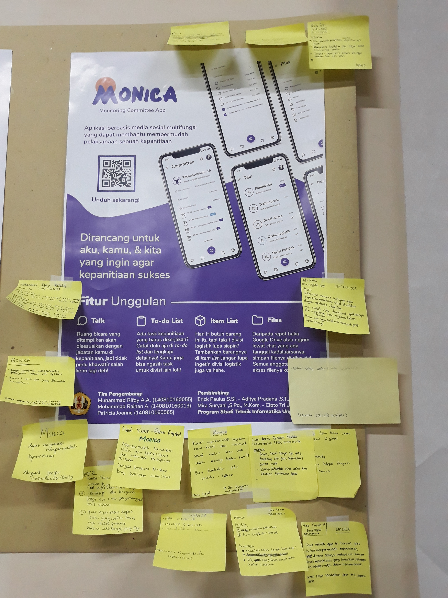

# Monica 2.1

Monica development will be ended with this project. I don't know if I will develop Monica anymore in the future but let's hope this idea won't be stolen by anyone...please...readers...

Okay so basically this semester I teamed up again with Rifqy and Raihan because we are the team of Monica 2.0 in the previous semester. Shofi joined too in this semester because her team was splitted up due to her absence this semester because she was in South Korea for a student exchange program. In this semester, Software Development 2 subject was taught by three lecturers but we hardly got a class session on this subject.

We also barely touched this project. Seriously we didn't understand anything about API. Yes, we were required to make an API for the app. We couldn't use Firebase anymore and the API should be original. We even failed the sign in API. There was a time when we were asked to report our progress. Here's the report in a video.



There was also a time when we were asked to make a promotional poster and the poster would be rated by Digital Business students. Monica got the most comments from the Digital Business students LOL. I guess everyone needs this app huh? The slavery in the committees stays strong.

Today we had to present the app to the lecturers as the final score. We were lucky we got the early session so that there was only Mrs. Mira who assessed us. We could pass the presentation easily haha. Oh yeah as usual I linked the repository. [Go check this out!](https://github.com/realicejoanne/ppl2-project/) Well, it's not working so don't expect too much.

