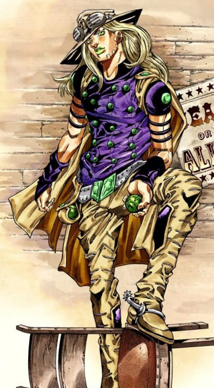
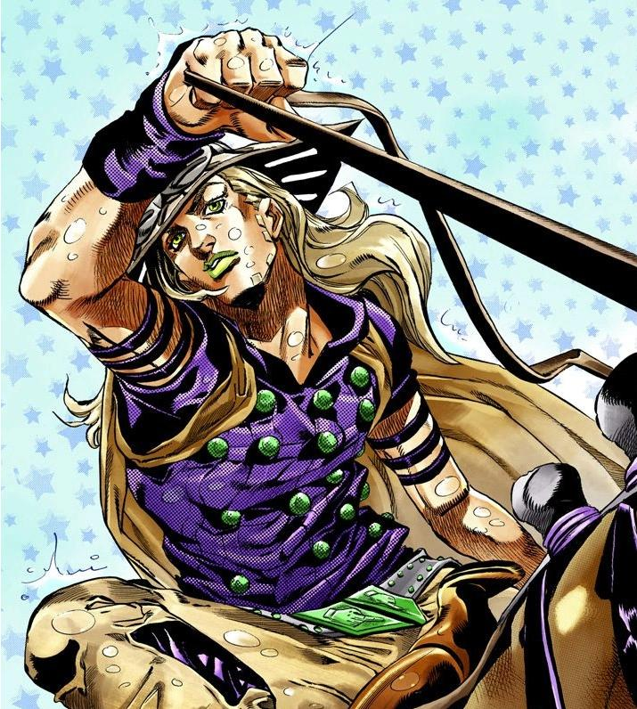
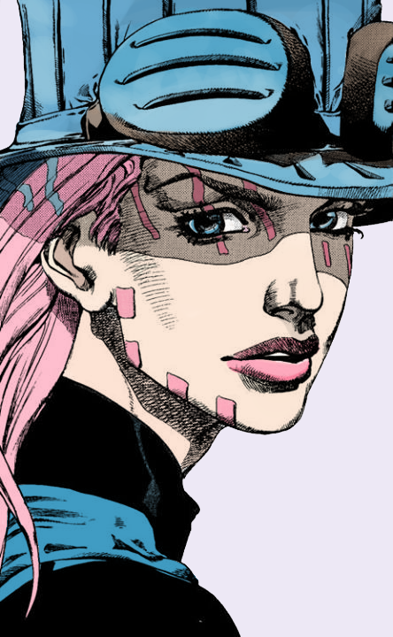

# JoJo Fan's Ordinary Essay Part 3

Alright so this is the part 3 of my rants about JoJo. No, I don't think there will be more parts haha. I already spent almost 2 months fangirling JoJo and I need to break since I have to focus on my internship report and thesis. In this post I am going to continue my opinions of Part 6 and 7 in detail.

**Stone Ocean** has the first female JoJo as the protagonist. Somehow fandom thinks females in the JoJo series always sucks. I also thought the same thing on a female protagonist because I am female as well so I know how annoying a female could be. Glad to see Jolyne was not just a spoiled tomboy girl and had the perfect personality to be a JoJo protagonist. I also like the allies of this part like Part 5. Each ally and the protagonist had their own features and got enough spotlights. Pucci was also likeable because he wasn't like the other main antagonists who just sat down and watched the chaos and then suddenly came as the main boss. As the main antagonist, he got his own personal development. So basically I don't get why people dislike this part. No, I don't want a reason like, "Hey the protagonist failed to save the world." or "What's the purpose of the personal development if all of them died?". My opinion about those reasoning is, Araki is the god of this series so he could do anything he liked. The reality wasn't always like we wanted to right? I wish I could see Part 6 become animated sooner. I am tired of defending this part. Thanks to Hamon Beat in YouTube who debunked some of "Araki forgot" moments about Part 6 which were absolutely stupid. I agreed with him very much. I even didn't know the "Araki forgot" moments that he explained about Part 6. In my opinion, as long as it didn't annoy the plotline it's okay. The video had the longest time just because to deal with stupid misunderstandings. He also debunked the previous parts too. Enjoy all of his videos in [this playlist](https://www.youtube.com/playlist?list=PLwhq07t0WOPaoyf_N8hzdz66hsHRmwY8-)!

This part repeated the sadness from the previous part, it became ironic. Damn _Jolyne, Jolyne, Jolyne, Joleeenee_. You can use the _Joestar's secret technique NIGERUNDAYOOOO_ before dealing with Made in Heaven. She was saved by Jotaro but she wasted that chance just to die and let Emporio finish it. Also I was kinda sad when F.F. sacrificed herself to Anasui and never saw Jotaro. I bet Jotaro would be happy to see F.F. because he was an "ocean man 🐬" so he would force Jolyne to marry F.F. instead of Anasui LOL. By the way this paragraph is a joke okay.

The thing that I dislike and also being an annoying plot hole from Part 6 is the same like the fandom's common thought I guess. We need Giorno damnit. I know he wouldn't join Pucci's team because he wasn't a failure as DIO's son but he could join Jolyne's right? I am disappointed that Jotaro only spied Giorno in the beginning and didn't get in contact with him again. Let's say, Giorno was busy with his mafia jobs and that's why he didn't join Jolyne's gang. He already achieved his dream to be a gangstar after all. To be honest, this became my reason to love Jotaro as my favorite JoJo protagonist and I will explain why.

I once simply chose Joseph as my favorite because he was a likeable man for me but after Part 2 he disappointed me too much. He didn't train his hamon ability. Wait, he actually hated the hamon training with Messina and Loggins back then and that's a bad decision. I mean, he could be like Lisa Lisa who had a younger appearance despite her old age. I guess it's because hamon wasn't practical anymore since there's no vampire anymore and everyone's being proud with their Stands. Okay let's say it's Stands time to rise but unfortunately Joseph also didn't train his Hermit Purple damnit. His stand was only used for finding DIO. After DIO's death he never used it anymore. So basically he acted like hamon and Stand are used only for his fate. He also said something contradictory about hating Japanese but had an illegitimate child from Japanese. Because I want to defend Joseph then I want to believe the fan theory of Tomoko raped Joseph LOL. Well this one is okay since I don't really care about anyone's love life though. After all, JoJo is about _the true man's world_.

Now compare him to Jotaro. Jotaro's goal to save his mother was achieved but he didn't stop there. In my opinion he worked for SPF as an agent with Stand. Even though one of his reasons to go to Morioh-cho was to visit Josuke as one of Joseph's heirs, he still cared about Stands phenomenon and helped Josuke to fight the antagonists. His appearance in Part 5 to spy on Giorno as DIO's son was also because of Stands. His decision to leave his wife and Jolyne was also because of Stands and he didn't want to hurt people who he loved very much. Unless they had Stands as well, he came and that's why he came after Jolyne manifested her Stand. What I want to say here is Jotaro cared a lot about Stands. He would fight against every enemy Stand user even though his goal was already achieved. He was different from Joseph and Giorno who only cared about Stands because of their fate. I didn't include Josuke because Josuke didn't have a powerful goal related to Stands like the other JoJos so he was definitely not likeable by me. Joseph fought against Pillar Men who wanted to get Red Stone of Aja and Giorno fought against Diavolo to be a _gangstar_ \(and stop drug dealing LOL\). Josuke fought against Kira who wasn't related to anything to him besides murders in Morioh-cho and avenging Shigechi's death. I wish Josuke would work as Jotaro's partner but yeah we won't get to see him again. That's why I like Jotaro compared to other JoJos and he deserved to get a lot of part appearances.

I am actually very sad about Jotaro. There's a term made by fandom called _PTSDio_ and that's very influential to Jotaro's life. In Jotaro's age of 17 he had to go around the world in 50 days because of Joestar's fate. He had to face the deaths of his teammates. Part 4 gave him a lot of PTSDios. Crazy Diamond's appearance is similar to The World, Koichi had the same uniform color with Kakyoin, and Kira the blondie evil like DIO. I think [this video](https://www.youtube.com/watch?v=-6ZLKOKIvF0) explained them a lot \(preview below this paragraph\). He had endured all of those things just because he cared. Jolyne's fate was actually similar to her father LOL. She was \(captured\) in jail at the beginning, had a fate to save her parent, had to burn herself to fight an annoying enemy Stand user \(Rykiel with Sky High, as in Part 3 ZZ with Wheel of Fortune\), and was thrown with knives by the main antagonist. This father-daughter's bond was very lit 🔥 I envied it very much. Ah yeah by the way Jotaro died with his head splitted up like Boingo's Thoth prediction. Jotaro, you really deserve a deep 'in memoriam' for your death. PLEASE DAVID PRODUCTIONS MAKE IT REAL.



Part 6 also led me to the world of Smolyne's wholesomeness with Dadtaro. Sometimes I also found Mudad \(DIO\) and Giorno's bond too. I can't cover up my feelings about Smolyne. As a female I can feel her. Guess I have to tell this story in the next part. Part 6 made me rant too much.

Let's talk about Part 7: **Steel Ball Run**. This might be a joke but why the race name was Steel "Ball" Run? Yes it was held by Stephen Steel but why Ball? It could be just Steel Run. Well that's not a pretty name though. I am in love and hate this part and I already told it in the first part of my rants. This universe was completely different from the Ireneverse and Gyro died. Because SBRverse was not Ireneverse, I am not sure we will see the main universe's life anymore. I am also not sure if we will have Part 9. Part 8 Jojolion took a very long time to finish. It was started in 2011 and it's still ongoing until today. Araki's age wasn't young anymore and if there will be Part 9 I am afraid the writer won't be Araki anymore.

In the beginning of Steel Ball Run, we were introduced with Gyro Zeppeli first then Johnny Joestar later and I once thought Gyro was the main character of SBR because he stole too many spotlights from Johnny Joestar. Gyro was cooler and Johnny was really a sadboi. I agree a lot that this part can be considered as a favorite part. I had told about the cool features that SBR had in part 1 of my rants. To be honest I even don't know what kind of plot hole that I can point out here. Rather than plot holes I caught too many miseries in this series. I even decreased my pace to read the whole manga too fast because I didn't want to feel sad. From a sadboi to have a _dark determination_, Johnny was awesome but he became a sadboi again after Gyro was dead. I feel bad for Diego and Hot Pants as well. Both of them had a miserable past they wanted to cleanse. I cried when I read Diego's past about his mother 😭 No, I don't feel sad towards Funny Valentine. I like him but he was kinda similar with Diavolo in avenging his past. I mean, they did anything even though it was evil just to deal with their past. Yes he was patriotic because he was impressed by his father's love for America but he's not as good as Pucci. Pucci wanted to "reset" the universe for everyone's sake except Joestars \(but instead he made Joestars live happily without him\). Funny Valentine threw out all miseries to the other side of the world. That's unfair and it would lead to a war dude!

Oh yeah I know what to point out in this part. Sandman, or rather liked to be called as "soundman", was a damn loser. He hated white people but he chose to be Funny Valentine's side. That's ironic. I expected to see a character development on him since he was the first character to be introduced even before Gyro and Johnny. It's okay if he wanted to be on Funny Valentine's side but I need an explanation. What kind of deal could he have? Or was there anything he left to his sister? I also didn't understand why Funny Valentine had a quite big number of Stand users on his side without the corpse. Did they develop them by themselves? If yes, how did he gather them? Or maybe he let those people use the corpse for a while but I wasn't sure about it because Hot Pants left a piece of the corpse's spine to Johnny so he wouldn't lose his Stand. I am too lazy to reread so I will wait until someone mentions this in the future LOL. I also need an explanation about the "Zombie Horse" mural which cured Gyro's leg and Johnny when he was shot. How did it work? One more, Johnny was surely a quick learner huh? But I guess that's just because of his strong will and let him learn Spin and develop his Stand very fast. By the way, some of Johnny's cries about hunting corpse parts made me want to hug Gyro so much. Gyro never cared about the corpse but because Johnny wanted it he was willing to help Johnny train Spin. If only Gyro still focused on the race he could beat Pocoloco. But yeah he was "Zeppeli the Joestar ally" after all and he was the softest Zeppeli in SBRverse so he felt Johnny was a cure to his loneliness and wanted to help him as a best friend.

I think that's all I can say about Part 7. To be honest I thought SBR was overhyped and made Part 6 look bad just because people wanted to read the new alternate universe part sooner. It is indeed overhyped but I still agree that Part 7 is good. The art design was also very beautiful. There were some lovely pictures of Gyro and I want to share it here HAHA. These rants are so bland without pictures. The pictures here are actually Araki's art but I didn't find the good screenshots of the last three pictures \(too lazy to reread just to find those beautiful faces\) so I put the edited one instead.

Well I think I take my words back on "not having a new part of ranting JoJo". I try to not expand the rants too much but _4 is an unlucky number_ as Mista said so let's see if I could think of an idea to keep the ranting until 5 at least. Next part should be about the wholesomeness of JoJo.

