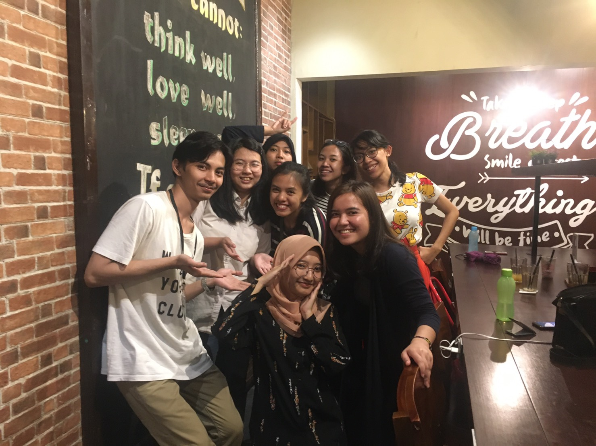

# Looking For New Upgraders

It’s time for me to retire from International Office Unpad. I actually want to spend more time there but my thesis is waiting for me. Honestly, I am really worried about the next generation. My division only has David as the successor. David is great, I really like all of his designs, but didn’t he say that he is busy with his college studies?

On March 1, we held the last gathering of the current Upgraders. Yes, it was a gathering not a meeting so we didn’t have to be formal. We talked about evaluations and hopes for the next generation. We also took pics together! Not all of the people who joined the gathering were in the photo because some of them already went home.

We started the recruitment registration on February 28 and closed it on March 7. Too bad the applicants were not as many as for the current generation’s recruitment. But I hope they are good, especially for the design division. I helped to interview the design division applicants since the other design division members are busy. Somehow I think their experiences are better than mine when I applied to International Office lol. But their dedication is kinda off. Some said they're busy with their current activities, some also didn't know a lot about International Office and joined only because of curiosity. It's pretty easy for me to decide who I want to choose for the design division team after the interviews. I also succeed to keep David stay in the International Office as the head of the division along with the new members.

